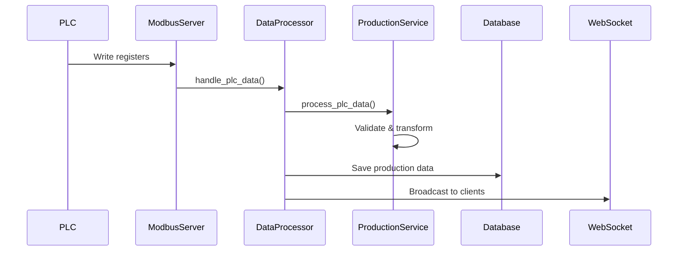
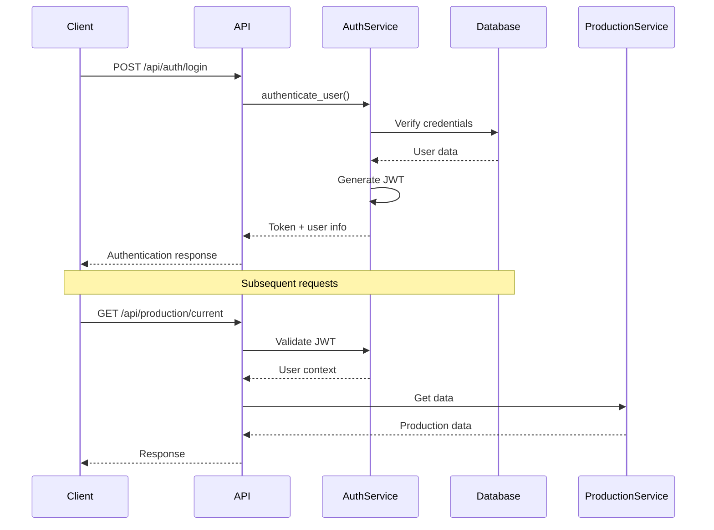

# 🏗️ Architecture Guide

## 🎯 Visión General

El Sistema de Producción está diseñado siguiendo los principios de **Clean Architecture** (Arquitectura Hexagonal), proporcionando:

- ✅ **Separación de responsabilidades**
- ✅ **Testabilidad** y mantenibilidad
- ✅ **Independencia de frameworks**
- ✅ **Flexibilidad** para cambios tecnológicos

## 📊 Diagrama de Arquitectura

```
┌─────────────────────────────────────────────────────────────┐
│                     PRESENTATION LAYER                      │
├─────────────────────────────────────────────────────────────┤
│  ┌──────────────┐  ┌──────────────┐  ┌──────────────┐      │
│  │   FastAPI    │  │  WebSocket   │  │  Web Client  │      │
│  │   Routes     │  │   Manager    │  │     UI       │      │
│  └──────────────┘  └──────────────┘  └──────────────┘      │
└─────────────────────────────────────────────────────────────┘
                            │
                            ▼
┌─────────────────────────────────────────────────────────────┐
│                   APPLICATION LAYER                         │
├─────────────────────────────────────────────────────────────┤
│  ┌──────────────┐  ┌──────────────┐  ┌──────────────┐      │
│  │ Production   │  │    Auth      │  │    Data      │      │
│  │   Service    │  │  Service     │  │  Processor   │      │
│  └──────────────┘  └──────────────┘  └──────────────┘      │
└─────────────────────────────────────────────────────────────┘
                            │
                            ▼
┌─────────────────────────────────────────────────────────────┐
│                     DOMAIN LAYER                            │
├─────────────────────────────────────────────────────────────┤
│  ┌──────────────┐  ┌──────────────┐  ┌──────────────┐      │
│  │ Production   │  │   System     │  │   Quality    │      │
│  │    Data      │  │   Event      │  │   Status     │      │
│  └──────────────┘  └──────────────┘  └──────────────┘      │
└─────────────────────────────────────────────────────────────┘
                            │
                            ▼
┌─────────────────────────────────────────────────────────────┐
│                  INFRASTRUCTURE LAYER                       │
├─────────────────────────────────────────────────────────────┤
│  ┌─────────────┐ ┌─────────────┐ ┌─────────────┐ ┌────────┐ │
│  │ PostgreSQL  │ │   Modbus    │ │   Logging   │ │ Config │ │
│  │ Repository  │ │   Server    │ │   System    │ │Manager │ │
│  └─────────────┘ └─────────────┘ └─────────────┘ └────────┘ │
└─────────────────────────────────────────────────────────────┘
                            │
                            ▼
┌─────────────────────────────────────────────────────────────┐
│                    EXTERNAL SYSTEMS                         │
├─────────────────────────────────────────────────────────────┤
│  ┌─────────────┐ ┌─────────────┐ ┌─────────────┐ ┌────────┐ │
│  │ PostgreSQL  │ │    PLC      │ │  File Log   │ │ Docker │ │
│  │  Database   │ │  Hardware   │ │   System    │ │Registry│ │
│  └─────────────┘ └─────────────┘ └─────────────┘ └────────┘ │
└─────────────────────────────────────────────────────────────┘
```

## 🧩 Componentes Principales

### 🎮 Presentation Layer

#### FastAPI Routes (`app/infrastructure/api/routes.py`)
- **Responsabilidad**: Manejo de HTTP requests/responses
- **Características**:
  - Validación automática con Pydantic
  - Documentación automática con OpenAPI
  - Manejo de autenticación JWT
  - CORS configurado

#### WebSocket Manager (`app/infrastructure/websocket/manager.py`)
- **Responsabilidad**: Comunicación en tiempo real
- **Características**:
  - Broadcast de datos de producción
  - Manejo de conexiones concurrentes
  - Heartbeat/ping-pong

#### Web Client (`app/presentation/web_client.py`)
- **Responsabilidad**: Interfaz web integrada
- **Características**:
  - Cliente WebSocket en tiempo real
  - Dashboard de monitoreo
  - Herramientas de debugging

### ⚙️ Application Layer

#### Production Service (`app/domain/services/production_service.py`)
- **Responsabilidad**: Lógica de negocio de producción
- **Operaciones**:
  - Procesamiento de datos PLC
  - Cálculo de estadísticas
  - Gestión de lotes
  - Validación de datos

#### Auth Service (`app/domain/services/auth_service.py`)
- **Responsabilidad**: Autenticación y autorización
- **Operaciones**:
  - Generación/validación JWT
  - Autenticación de usuarios
  - Control de acceso por roles
  - Auditoría de sesiones

#### Data Processor (`app/main.py`)
- **Responsabilidad**: Procesamiento asíncrono de datos
- **Características**:
  - Buffer de datos configurable
  - Procesamiento en background thread
  - Manejo de errores resiliente

### 🎯 Domain Layer

#### Production Data (`app/domain/models.py`)
```python
@dataclass
class ProductionData:
    timestamp: datetime
    product_id: int
    quality_status: QualityStatus
    production_count: int
    line_status: ProductionStatus
    error_code: int
    cycle_time_ms: int
    temperature: float
    pressure: float
    operator_id: int
    batch_id: str
```

#### Enumerations
```python
class ProductionStatus(Enum):
    STOPPED = 0
    RUNNING = 1
    ERROR = 2
    MAINTENANCE = 3

class QualityStatus(Enum):
    NOK = 0
    OK = 1
    PENDING = 2
```

### 🔧 Infrastructure Layer

#### Database Repository (`app/infrastructure/database/repository.py`)
- **Responsabilidad**: Persistencia de datos
- **Características**:
  - SQLAlchemy async ORM
  - Connection pooling
  - Transaction management
  - Repository pattern

#### Modbus Server (`app/infrastructure/modbus/server.py`)
- **Responsabilidad**: Comunicación industrial
- **Características**:
  - Servidor TCP asíncrono
  - Custom data blocks
  - Address mapping
  - Error handling

#### Logging System (`app/infrastructure/logging/config.py`)
- **Responsabilidad**: Sistema de logs
- **Características**:
  - Structured logging
  - File rotation
  - Multiple outputs
  - Level configuration

## 🔄 Flujo de Datos

### 📥 Ingesta de Datos PLC



### 🔐 Flujo de Autenticación



## 🏛️ Patrones de Diseño

### 🎭 Repository Pattern

Separa la lógica de acceso a datos de la lógica de negocio:

```python
# Abstract interface (Domain)
class ProductionRepositoryProtocol(Protocol):
    def save_production_data(self, data: ProductionData) -> bool:
        ...
    
    def get_production_history(self, limit: int) -> List[ProductionData]:
        ...

# Concrete implementation (Infrastructure)
class ProductionRepository:
    def __init__(self, db_manager: DatabaseManager):
        self.db_manager = db_manager
    
    async def save_production_data(self, data: ProductionData) -> bool:
        # Implementation details...
```

### 🏭 Factory Pattern

Para creación de servicios y configuración:

```python
class ServiceFactory:
    @staticmethod
    def create_production_service() -> ProductionService:
        repository = ProductionRepository(db_manager)
        batch_generator = BatchIdGenerator()
        return ProductionService(repository, batch_generator)
```

### 📡 Observer Pattern

Para notificaciones en tiempo real:

```python
class WebSocketManager:
    def __init__(self):
        self.connections: Set[WebSocket] = set()
    
    async def broadcast_production_data(self, data: ProductionData):
        for connection in self.connections:
            await connection.send_json({
                "type": "production_data",
                "data": data.to_dict()
            })
```

### 🎯 Dependency Injection

Manejo centralizado de dependencias:

```python
# Global instances
db_manager: Optional[DatabaseManager] = None
production_service: Optional[ProductionService] = None

async def setup_dependencies():
    global db_manager, production_service
    
    db_manager = DatabaseManager()
    repository = ProductionRepository(db_manager)
    production_service = ProductionService(repository, BatchIdGenerator())

def get_production_service() -> ProductionService:
    if production_service is None:
        raise RuntimeError("Service not initialized")
    return production_service
```

## 🔒 Seguridad

### 🛡️ Autenticación JWT

- **Algoritmo**: HS256
- **Expiración**: Configurable (default 30 min)
- **Claims**: user_id, username, roles
- **Validación**: En cada request protegido

### 🚪 Control de Acceso

```python
@admin_router.post("/users")
async def create_user(
    current_user: User = Depends(get_current_user)
):
    if current_user.role != UserRole.ADMIN:
        raise HTTPException(
            status_code=status.HTTP_403_FORBIDDEN,
            detail="Admin access required"
        )
```

### 🔐 Hashing de Contraseñas

- **Librería**: passlib con bcrypt
- **Salt**: Automático por bcrypt
- **Rounds**: 12 (configurable)

## 📈 Escalabilidad

### 🚀 Optimizaciones Implementadas

1. **Connection Pooling**: Para base de datos
2. **Async I/O**: FastAPI + SQLAlchemy async
3. **Background Processing**: Thread separado para datos
4. **Buffer Management**: Queue con límite configurable
5. **Logging Rotation**: Previene crecimiento infinito

### 📊 Puntos de Monitoreo

1. **Health Check**: `/api/system/health`
2. **Debug Endpoint**: `/api/system/debug/recent-data`
3. **Database Metrics**: Connection pool status
4. **Modbus Status**: Server health
5. **WebSocket Connections**: Active count

### 🔧 Configuración de Performance

```python
# Database
DATABASE_POOL_SIZE=10
DATABASE_ECHO=false

# Data Processing
DATA_BUFFER_SIZE=1000
WEBSOCKET_MAX_CONNECTIONS=100

# Logging
LOG_LEVEL=INFO  # Reduce to WARNING in production
```

## 🧪 Testing Strategy

### 🎯 Unit Tests
- **Domain Layer**: Lógica de negocio pura
- **Services**: Mocking de dependencies
- **Utilities**: Validaciones y transformaciones

### 🔗 Integration Tests
- **Database**: Repository layer
- **API**: Endpoint functionality
- **Modbus**: Communication layer

### 🌐 End-to-End Tests
- **Full Flow**: PLC → Database → WebSocket
- **Authentication**: Login → Protected endpoints
- **Error Scenarios**: Network failures, invalid data

## 📦 Deployment Considerations

### 🐳 Docker Strategy
- **Multi-stage builds**: Optimize image size
- **Health checks**: Container monitoring
- **Volume mounts**: Persistent data
- **Network isolation**: Security

### 🏗️ Environment Configuration
- **Development**: Local PostgreSQL + debug logs
- **Staging**: Docker compose + realistic data
- **Production**: External DB + monitoring + secrets

### 📊 Monitoring & Observability
- **Structured Logging**: JSON format for analysis
- **Health Endpoints**: Kubernetes readiness/liveness
- **Metrics**: Custom metrics via FastAPI middleware
- **Alerts**: Critical error notifications

---

## 🔄 Próximos Pasos de Arquitectura

1. **Microservices**: Separar componentes por bounded contexts
2. **Event Sourcing**: Para auditoría completa
3. **CQRS**: Separar read/write models
4. **Message Queues**: Redis/RabbitMQ para async processing
5. **API Gateway**: Rate limiting, routing, authentication 