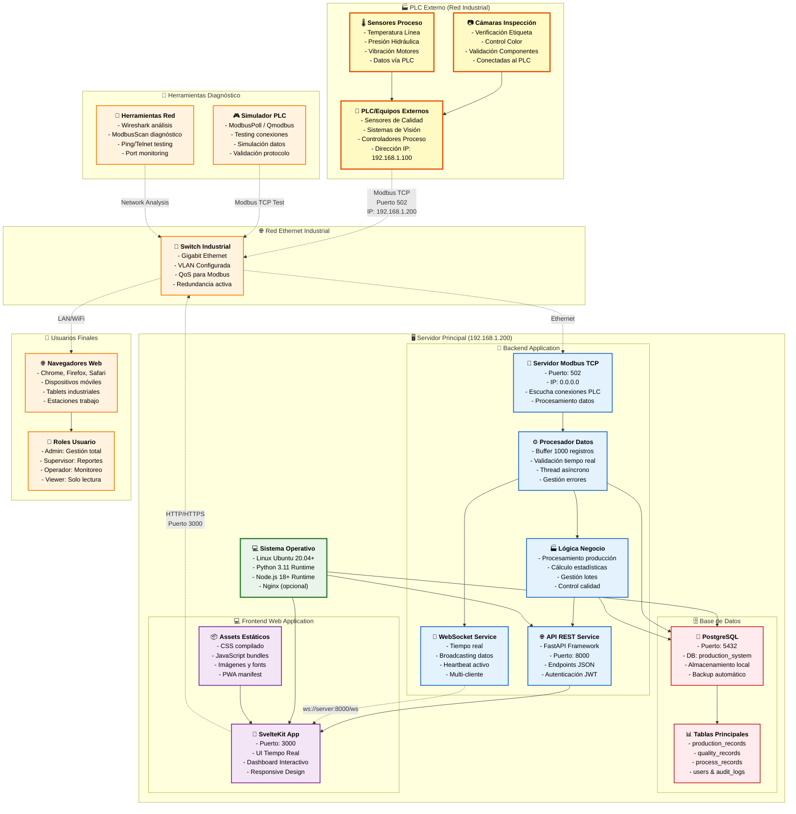

# 🏗️ Arquitectura del Sistema - Servidor Único

## Descripción
Diagrama de la arquitectura completa del sistema de producción industrial con servidor único, PLC externo conectado vía Modbus TCP.

## Componentes Principales

### 🏭 PLC Externo
- **Ubicación**: Red industrial separada
- **IP**: 192.168.1.100 (configurable)
- **Protocolo**: Modbus TCP puerto 502
- **Integra**: Cámaras, sensores, controladores

### 🖥️ Servidor Principal  
- **IP**: 192.168.1.200
- **OS**: Linux Ubuntu 20.04+
- **Backend**: FastAPI + Python 3.11
- **Frontend**: SvelteKit + Node.js 18
- **DB**: PostgreSQL local

### 🌐 Acceso Usuarios
- **Puerto Frontend**: 3000
- **Puerto API**: 8000
- **WebSocket**: ws://server:8000/ws
- **Múltiples clientes simultáneos**



## Ventajas de esta Arquitectura

### ✅ Simplicidad
- Un solo servidor para gestionar
- Instalación directa sin contenedores
- Configuración centralizada

### ✅ Performance
- Comunicación directa entre componentes
- Sin overhead de Docker
- Acceso directo a recursos sistema

### ✅ Mantenimiento
- Logs centralizados en servidor
- Backup simplificado
- Updates coordinados

### ✅ Escalabilidad
- Preparado para múltiples PLCs
- Soporte múltiples usuarios
- Base para futura expansión

## Requisitos de Red

### IP Addresses
- **Servidor**: 192.168.1.200
- **PLC**: 192.168.1.100
- **Subnet**: 192.168.1.0/24

### Puertos Utilizados
- **502**: Modbus TCP (PLC → Servidor)
- **3000**: Frontend Web
- **8000**: API REST + WebSocket
- **5432**: PostgreSQL (local)

### Firewall Rules
```bash
# Permitir Modbus TCP desde PLC
iptables -A INPUT -s 192.168.1.100 -p tcp --dport 502 -j ACCEPT

# Permitir acceso web desde LAN
iptables -A INPUT -s 192.168.1.0/24 -p tcp --dport 3000 -j ACCEPT
iptables -A INPUT -s 192.168.1.0/24 -p tcp --dport 8000 -j ACCEPT
``` 