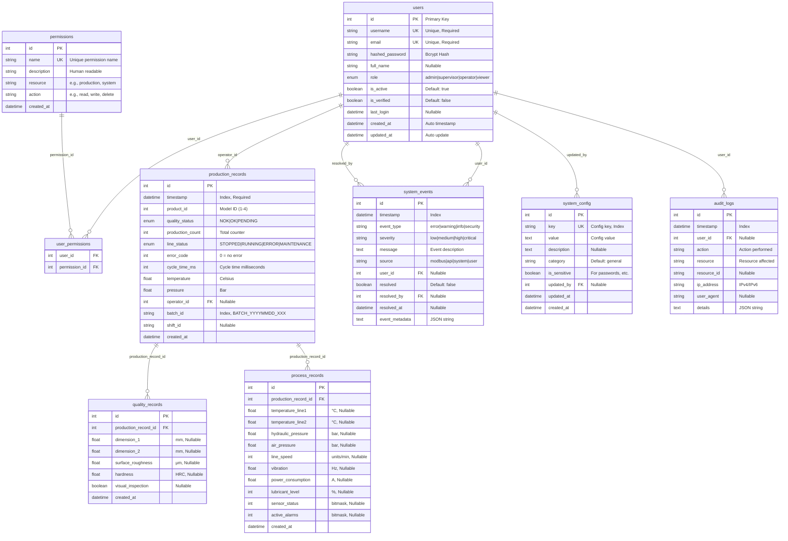

# 🗄️ Esquema de Base de Datos PostgreSQL

## Descripción
Diagrama del esquema completo de la base de datos `production_system` con todas las tablas, relaciones y restricciones.

## Base de Datos Principal
- **Nombre**: production_system
- **Motor**: PostgreSQL 15
- **Encoding**: UTF-8
- **Schemas**: public, production, auth, audit, config

## Tablas del Sistema

### 📊 Datos de Producción
- **production_records**: Registro principal de cada pieza
- **quality_records**: Datos detallados de inspección
- **process_records**: Parámetros de proceso operativo

### 👥 Gestión de Usuarios
- **users**: Credenciales y perfiles de usuario
- **permissions**: Permisos granulares del sistema
- **user_permissions**: Relación N:M usuarios-permisos

### 📝 Auditoría y Eventos
- **audit_logs**: Trazabilidad de todas las acciones
- **system_events**: Eventos y alertas del sistema
- **system_config**: Configuración dinámica



## Índices Principales

### 🔍 Índices de Performance
```sql
-- Índices para consultas frecuentes
CREATE INDEX idx_production_timestamp ON production_records(timestamp);
CREATE INDEX idx_production_batch ON production_records(batch_id);
CREATE INDEX idx_production_status ON production_records(line_status);
CREATE INDEX idx_quality_status ON production_records(quality_status);

-- Índices para auditoría
CREATE INDEX idx_audit_timestamp ON audit_logs(timestamp);
CREATE INDEX idx_audit_user ON audit_logs(user_id);
CREATE INDEX idx_events_timestamp ON system_events(timestamp);
CREATE INDEX idx_events_severity ON system_events(severity);

-- Índices únicos
CREATE UNIQUE INDEX idx_users_username ON users(username);
CREATE UNIQUE INDEX idx_users_email ON users(email);
CREATE UNIQUE INDEX idx_config_key ON system_config(key);
```

## Vistas Principales

### 📊 Vista Resumen Producción
```sql
CREATE VIEW production_summary AS
SELECT 
    DATE(timestamp) as production_date,
    COUNT(*) as total_records,
    SUM(production_count) as total_production,
    AVG(cycle_time_ms) as avg_cycle_time,
    COUNT(CASE WHEN quality_status = 'OK' THEN 1 END) as good_quality_count,
    COUNT(CASE WHEN quality_status = 'NOK' THEN 1 END) as bad_quality_count,
    ROUND(100.0 * COUNT(CASE WHEN quality_status = 'OK' THEN 1 END) / COUNT(*), 2) as quality_rate
FROM production_records 
GROUP BY DATE(timestamp)
ORDER BY production_date DESC;
```

### 👥 Vista Actividad Usuarios
```sql
CREATE VIEW user_activity AS
SELECT 
    u.username,
    u.role,
    u.last_login,
    COUNT(al.id) as total_actions,
    MAX(al.timestamp) as last_action
FROM users u
LEFT JOIN audit_logs al ON u.id = al.user_id
GROUP BY u.id, u.username, u.role, u.last_login
ORDER BY last_action DESC NULLS LAST;
```

## Configuración de Backup

### 🔄 Backup Automático
```bash
#!/bin/bash
# Script de backup automático
BACKUP_DIR="/var/backups/production_system"
DATE=$(date +%Y%m%d_%H%M%S)

# Backup completo
pg_dump production_system > "$BACKUP_DIR/full_backup_$DATE.sql"

# Backup solo datos
pg_dump --data-only production_system > "$BACKUP_DIR/data_only_$DATE.sql"

# Comprimir y limpiar backups antiguos
gzip "$BACKUP_DIR/full_backup_$DATE.sql"
find "$BACKUP_DIR" -name "*.gz" -mtime +30 -delete
```

## Mantenimiento

### 🧹 Limpieza de Datos Antiguos
```sql
-- Eliminar audit_logs mayores a 1 año
DELETE FROM audit_logs 
WHERE timestamp < NOW() - INTERVAL '365 days';

-- Eliminar system_events resueltos mayores a 6 meses
DELETE FROM system_events 
WHERE resolved = true 
AND resolved_at < NOW() - INTERVAL '180 days';

-- Actualizar estadísticas
ANALYZE production_records;
ANALYZE quality_records;
ANALYZE process_records;
```

### 📈 Monitoreo de Performance
```sql
-- Consultas más lentas
SELECT 
    query,
    calls,
    total_time,
    mean_time,
    rows
FROM pg_stat_statements 
ORDER BY total_time DESC 
LIMIT 10;

-- Tamaño de tablas
SELECT 
    schemaname,
    tablename,
    pg_size_pretty(pg_total_relation_size(schemaname||'.'||tablename)) as size
FROM pg_tables 
WHERE schemaname = 'public'
ORDER BY pg_total_relation_size(schemaname||'.'||tablename) DESC;
``` 