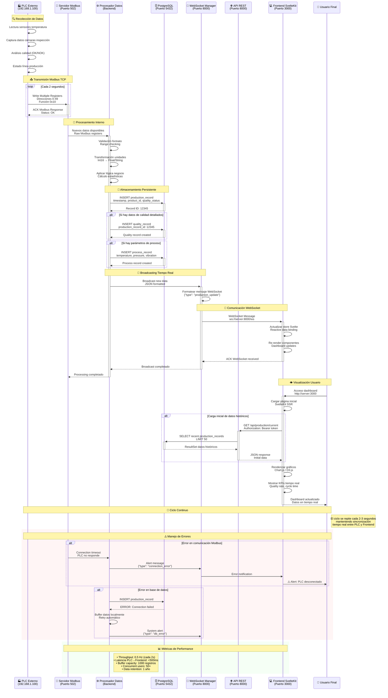

# 📊 Flujo de Datos: PLC → Servidor → Frontend

## Descripción
Diagrama de secuencia del flujo completo de datos desde el PLC externo hasta la visualización en el frontend, mostrando todos los pasos y procesos intermedios.

## Actores del Sistema
- **PLC Externo**: Equipos industriales con datos de producción
- **Servidor Modbus**: Receptor y procesador de datos Modbus TCP
- **Base de Datos**: Almacenamiento persistente PostgreSQL
- **API REST**: Servicios web para consultas
- **WebSocket**: Comunicación tiempo real
- **Frontend**: Interfaz de usuario SvelteKit

## Flujo Principal de Datos

### 🔄 Ciclo Completo de Datos
1. **Captura**: PLC recolecta datos de sensores/cámaras
2. **Transmisión**: Envío vía Modbus TCP al servidor
3. **Procesamiento**: Validación y transformación de datos
4. **Almacenamiento**: Persistencia en PostgreSQL
5. **Distribución**: Broadcasting vía WebSocket
6. **Visualización**: Actualización en tiempo real del frontend



## Detalles Técnicos del Flujo

### 📡 Protocolo Modbus TCP
```
┌─────────────────┬─────────────────┬─────────────────┐
│   MBAP Header   │  Function Code  │      Data       │
├─────────────────┼─────────────────┼─────────────────┤
│ TID │ PID │ LEN │ UID │   0x10     │ Addr │ Qty │ Val │
│  2  │  2  │  2  │  1  │     1      │  2   │  2  │ N*2 │
└─────────────────┴─────────────────┴─────────────────┘

• TID: Transaction ID (incrementa por mensaje)
• PID: Protocol ID (siempre 0x0000 para Modbus)
• LEN: Longitud campos siguientes
• UID: Unit ID (dirección dispositivo esclavo)
• Función 0x10: Write Multiple Registers
```

### ⚙️ Transformación de Datos
```python
# Ejemplo transformación datos PLC
raw_registers = [0x1A40, 0x0000, 0x0001, 0x0064]  # Del PLC

# Conversión a valores de aplicación
temperature = struct.unpack('>f', 
    struct.pack('>HH', raw_registers[0], raw_registers[1]))[0]
quality_status = "OK" if raw_registers[2] == 1 else "NOK"
cycle_time = raw_registers[3] * 10  # ms

# Formato para base de datos
production_data = {
    "timestamp": datetime.utcnow(),
    "temperature": round(temperature, 2),
    "quality_status": quality_status,
    "cycle_time_ms": cycle_time,
    "product_id": extract_product_id(raw_registers)
}
```

### 📊 Estructura Mensaje WebSocket
```json
{
  "type": "production_update",
  "timestamp": "2024-01-15T10:30:45.123Z",
  "data": {
    "production_record": {
      "id": 12345,
      "product_id": 2,
      "quality_status": "OK",
      "production_count": 1547,
      "cycle_time_ms": 2340,
      "temperature": 23.5,
      "batch_id": "BATCH_20240115_001"
    },
    "quality_metrics": {
      "dimension_1": 10.05,
      "dimension_2": 5.12,
      "visual_inspection": true
    },
    "line_status": {
      "status": "RUNNING",
      "speed": 25,
      "efficiency": 94.2
    }
  },
  "metadata": {
    "source": "modbus_server",
    "version": "1.0",
    "sequence": 15472
  }
}
```

## Configuración de Timing

### ⏱️ Intervalos de Comunicación
- **PLC → Servidor**: 2 segundos (configurable)
- **Procesamiento**: <100ms por ciclo
- **DB Insert**: <50ms promedio
- **WebSocket Broadcast**: <10ms
- **Frontend Update**: Inmediato (reactive)

### 🔄 Gestión de Buffer
```
┌──────────────┬──────────────┬──────────────┐
│   Buffer 1   │   Buffer 2   │   Buffer 3   │
│   (Active)   │  (Processing)│   (Backup)   │
├──────────────┼──────────────┼──────────────┤
│ Size: 1000   │ Size: 1000   │ Size: 1000   │
│ Status: Write│ Status: Read │ Status: Idle │
│ Records: 247 │ Records: 1000│ Records: 0   │
└──────────────┴──────────────┴──────────────┘

Rotation: Cada 2 minutos o cuando buffer lleno
Persistence: Automática cada 30 segundos
Recovery: Buffer backup en caso de fallo
```

## Monitoreo y Diagnóstico

### 📈 Métricas del Sistema
```sql
-- Query para métricas en tiempo real
SELECT 
    COUNT(*) as total_records_today,
    AVG(cycle_time_ms) as avg_cycle_time,
    MAX(timestamp) as last_update,
    COUNT(CASE WHEN quality_status = 'OK' THEN 1 END) * 100.0 / COUNT(*) as quality_rate
FROM production_records 
WHERE DATE(timestamp) = CURRENT_DATE;
```

### 🚨 Alertas Automáticas
- **Timeout PLC**: >5 segundos sin datos
- **Quality Drop**: Calidad <90% en última hora
- **DB Lag**: Inserción >1 segundo
- **WebSocket Disconnect**: >10 clientes desconectados
- **Memory Usage**: Buffer >80% capacidad 