# 📡 Mapeo de Direcciones Modbus TCP

## Descripción
Mapeo completo de los registros Modbus TCP utilizados para comunicación entre PLC externo y servidor backend. Direcciones 0-49 con propósitos específicos.

## Configuración Modbus

### 🔧 Parámetros de Conexión
- **Protocolo**: Modbus TCP/IP
- **Puerto**: 502
- **Función Principal**: 0x10 (Write Multiple Registers)
- **Función Lectura**: 0x03 (Read Holding Registers)
- **IP Servidor**: 192.168.1.200
- **IP PLC**: 192.168.1.100
- **Unit ID**: 1 (configurable)

## Mapa de Registros Modbus

```mermaid
graph TD
    subgraph "📊 Rangos de Direcciones Modbus"
        BasicData["`**📈 Datos Básicos** (0-9)<br/>Status, Contadores, Tiempos`"]
        QualityData["`**🔍 Datos Calidad** (10-19)<br/>Inspección, Mediciones`"]
        ProcessData["`**⚙️ Datos Proceso** (20-29)<br/>Temperatura, Presión, Velocidad`"]
        CameraData["`**📷 Datos Cámaras** (30-39)<br/>Resultados Inspección Visual`"]
        SystemData["`**⚠️ Sistema/Alarmas** (40-49)<br/>Estados, Errores, Diagnósticos`"]
    end

    subgraph "🎯 Detalle por Dirección"
        subgraph "Básicos 0-9"
            Addr0["`**0**: Product ID<br/>Modelo actual (1-4)`"]
            Addr1["`**1**: Quality Status<br/>0=NOK, 1=OK, 2=PENDING`"]
            Addr2["`**2**: Production Count H<br/>Contador alto (16 bits)`"]
            Addr3["`**3**: Production Count L<br/>Contador bajo (16 bits)`"]
            Addr4["`**4**: Line Status<br/>0=STOP, 1=RUN, 2=ERROR`"]
            Addr5["`**5**: Cycle Time H<br/>Tiempo ciclo ms (alto)`"]
            Addr6["`**6**: Cycle Time L<br/>Tiempo ciclo ms (bajo)`"]
            Addr7["`**7**: Error Code<br/>0-8 códigos específicos`"]
            Addr8["`**8**: Batch Number H<br/>Número lote (alto)`"]
            Addr9["`**9**: Batch Number L<br/>Número lote (bajo)`"]
        end

        subgraph "Calidad 10-19"
            Addr10["`**10**: Dimension 1 H<br/>Medición 1 (alto) x100`"]
            Addr11["`**11**: Dimension 1 L<br/>Medición 1 (bajo) x100`"]
            Addr12["`**12**: Dimension 2 H<br/>Medición 2 (alto) x100`"]
            Addr13["`**13**: Dimension 2 L<br/>Medición 2 (bajo) x100`"]
            Addr14["`**14**: Surface Roughness<br/>Rugosidad x1000`"]
            Addr15["`**15**: Hardness<br/>Dureza x10`"]
            Addr16["`**16**: Visual Status<br/>0=FAIL, 1=PASS`"]
            Addr17["`**17**: Test Results<br/>Bitfield resultados`"]
            Addr18["`**18**: Reserved<br/>Futuro uso calidad`"]
            Addr19["`**19**: Reserved<br/>Futuro uso calidad`"]
        end

        subgraph "Proceso 20-29"
            Addr20["`**20**: Temperature H<br/>Temp línea 1 (alto) x100`"]
            Addr21["`**21**: Temperature L<br/>Temp línea 1 (bajo) x100`"]
            Addr22["`**22**: Temp Line 2 H<br/>Temp línea 2 (alto) x100`"]
            Addr23["`**23**: Temp Line 2 L<br/>Temp línea 2 (bajo) x100`"]
            Addr24["`**24**: Hydraulic Pressure<br/>Presión hidráulica x100`"]
            Addr25["`**25**: Air Pressure<br/>Presión aire x100`"]
            Addr26["`**26**: Line Speed<br/>Velocidad línea upm`"]
            Addr27["`**27**: Vibration<br/>Vibración x1000`"]
            Addr28["`**28**: Power Consumption<br/>Consumo corriente x100`"]
            Addr29["`**29**: Lubricant Level<br/>Nivel lubricante %`"]
        end

        subgraph "Cámaras 30-39"
            Addr30["`**30**: Camera 1 Status<br/>Estado cámara 1`"]
            Addr31["`**31**: Camera 1 Result<br/>Resultado inspección 1`"]
            Addr32["`**32**: Camera 2 Status<br/>Estado cámara 2`"]
            Addr33["`**33**: Camera 2 Result<br/>Resultado inspección 2`"]
            Addr34["`**34**: Camera 3 Status<br/>Estado cámara 3`"]
            Addr35["`**35**: Camera 3 Result<br/>Resultado inspección 3`"]
            Addr36["`**36**: Vision Analysis<br/>Análisis conjunto`"]
            Addr37["`**37**: Color Check<br/>Verificación color`"]
            Addr38["`**38**: Label Check<br/>Verificación etiqueta`"]
            Addr39["`**39**: Reserved Vision<br/>Futuro visión`"]
        end

        subgraph "Sistema 40-49"
            Addr40["`**40**: System Status<br/>Estado general sistema`"]
            Addr41["`**41**: Active Alarms H<br/>Alarmas activas (alto)`"]
            Addr42["`**42**: Active Alarms L<br/>Alarmas activas (bajo)`"]
            Addr43["`**43**: Sensor Status<br/>Estado sensores bitfield`"]
            Addr44["`**44**: Communication<br/>Estado comunicaciones`"]
            Addr45["`**45**: Timestamp H<br/>Marca tiempo (alto)`"]
            Addr46["`**46**: Timestamp L<br/>Marca tiempo (bajo)`"]
            Addr47["`**47**: Sequence Number<br/>Número secuencia`"]
            Addr48["`**48**: Heartbeat<br/>Pulso vida (incrementa)`"]
            Addr49["`**49**: Checksum<br/>Suma verificación`"]
        end
    end

    BasicData --> Addr0
    BasicData --> Addr1
    BasicData --> Addr2
    BasicData --> Addr3
    BasicData --> Addr4
    BasicData --> Addr5
    BasicData --> Addr6
    BasicData --> Addr7
    BasicData --> Addr8
    BasicData --> Addr9

    QualityData --> Addr10
    QualityData --> Addr11
    QualityData --> Addr12
    QualityData --> Addr13
    QualityData --> Addr14
    QualityData --> Addr15
    QualityData --> Addr16
    QualityData --> Addr17
    QualityData --> Addr18
    QualityData --> Addr19

    ProcessData --> Addr20
    ProcessData --> Addr21
    ProcessData --> Addr22
    ProcessData --> Addr23
    ProcessData --> Addr24
    ProcessData --> Addr25
    ProcessData --> Addr26
    ProcessData --> Addr27
    ProcessData --> Addr28
    ProcessData --> Addr29

    CameraData --> Addr30
    CameraData --> Addr31
    CameraData --> Addr32
    CameraData --> Addr33
    CameraData --> Addr34
    CameraData --> Addr35
    CameraData --> Addr36
    CameraData --> Addr37
    CameraData --> Addr38
    CameraData --> Addr39

    SystemData --> Addr40
    SystemData --> Addr41
    SystemData --> Addr42
    SystemData --> Addr43
    SystemData --> Addr44
    SystemData --> Addr45
    SystemData --> Addr46
    SystemData --> Addr47
    SystemData --> Addr48
    SystemData --> Addr49

    classDef basic fill:#BBDEFB,stroke:#0D47A1,color:#000
    classDef quality fill:#C8E6C9,stroke:#1B5E20,color:#000
    classDef process fill:#FFE0B2,stroke:#E65100,color:#000
    classDef camera fill:#E1BEE7,stroke:#4A148C,color:#000
    classDef system fill:#FFCDD2,stroke:#B71C1C,color:#000

    class Addr0,Addr1,Addr2,Addr3,Addr4,Addr5,Addr6,Addr7,Addr8,Addr9 basic
    class Addr10,Addr11,Addr12,Addr13,Addr14,Addr15,Addr16,Addr17,Addr18,Addr19 quality
    class Addr20,Addr21,Addr22,Addr23,Addr24,Addr25,Addr26,Addr27,Addr28,Addr29 process
    class Addr30,Addr31,Addr32,Addr33,Addr34,Addr35,Addr36,Addr37,Addr38,Addr39 camera
    class Addr40,Addr41,Addr42,Addr43,Addr44,Addr45,Addr46,Addr47,Addr48,Addr49 system
```



## Tabla Detallada de Registros

### 📊 Datos Básicos de Producción (0-9)

| Dir | Nombre | Tipo | Rango | Unidad | Descripción |
|-----|--------|------|--------|--------|-------------|
| 0 | Product ID | INT16 | 1-4 | - | Modelo de producto actual |
| 1 | Quality Status | ENUM | 0-2 | - | 0=NOK, 1=OK, 2=PENDING |
| 2-3 | Production Count | INT32 | 0-999999 | pcs | Contador total producción |
| 4 | Line Status | ENUM | 0-3 | - | 0=STOP, 1=RUN, 2=ERROR, 3=MAINT |
| 5-6 | Cycle Time | INT32 | 0-60000 | ms | Tiempo de ciclo actual |
| 7 | Error Code | INT16 | 0-8 | - | Código error específico |
| 8-9 | Batch Number | INT32 | 1-999999 | - | Número de lote actual |

### 🔍 Datos de Calidad (10-19)

| Dir | Nombre | Tipo | Rango | Unidad | Descripción |
|-----|--------|------|--------|--------|-------------|
| 10-11 | Dimension 1 | FLOAT32 | 0-100.00 | mm | Medición dimensional 1 |
| 12-13 | Dimension 2 | FLOAT32 | 0-100.00 | mm | Medición dimensional 2 |
| 14 | Surface Roughness | INT16 | 0-1000 | μm*1000 | Rugosidad superficie |
| 15 | Hardness | INT16 | 0-1000 | HRC*10 | Dureza material |
| 16 | Visual Inspection | BOOL | 0-1 | - | Resultado inspección visual |
| 17 | Test Results | BITFIELD | 0-65535 | - | Resultados tests eléctricos |
| 18-19 | Reserved | - | - | - | Reservado para futuro uso |

### ⚙️ Datos de Proceso (20-29)

| Dir | Nombre | Tipo | Rango | Unidad | Descripción |
|-----|--------|------|--------|--------|-------------|
| 20-21 | Temperature Line 1 | FLOAT32 | -50.0-150.0 | °C | Temperatura línea 1 |
| 22-23 | Temperature Line 2 | FLOAT32 | -50.0-150.0 | °C | Temperatura línea 2 |
| 24 | Hydraulic Pressure | INT16 | 0-1000 | bar*100 | Presión hidráulica |
| 25 | Air Pressure | INT16 | 0-1000 | bar*100 | Presión neumática |
| 26 | Line Speed | INT16 | 0-200 | upm | Velocidad línea |
| 27 | Vibration | INT16 | 0-1000 | Hz*1000 | Vibración equipos |
| 28 | Power Consumption | INT16 | 0-5000 | A*100 | Consumo corriente |
| 29 | Lubricant Level | INT16 | 0-100 | % | Nivel lubricante |

### 📷 Datos de Cámaras (30-39)

| Dir | Nombre | Tipo | Rango | Unidad | Descripción |
|-----|--------|------|--------|--------|-------------|
| 30 | Camera 1 Status | ENUM | 0-3 | - | 0=OFF, 1=OK, 2=ERROR, 3=CALIB |
| 31 | Camera 1 Result | ENUM | 0-2 | - | 0=FAIL, 1=PASS, 2=UNKNOWN |
| 32 | Camera 2 Status | ENUM | 0-3 | - | Estado cámara 2 |
| 33 | Camera 2 Result | ENUM | 0-2 | - | Resultado cámara 2 |
| 34 | Camera 3 Status | ENUM | 0-3 | - | Estado cámara 3 |
| 35 | Camera 3 Result | ENUM | 0-2 | - | Resultado cámara 3 |
| 36 | Vision Analysis | BITFIELD | 0-255 | - | Análisis conjunto visión |
| 37 | Color Check | ENUM | 0-2 | - | Verificación color |
| 38 | Label Check | ENUM | 0-2 | - | Verificación etiqueta |
| 39 | Reserved Vision | - | - | - | Reservado visión |

### ⚠️ Datos del Sistema (40-49)

| Dir | Nombre | Tipo | Rango | Unidad | Descripción |
|-----|--------|------|--------|--------|-------------|
| 40 | System Status | BITFIELD | 0-65535 | - | Estado general sistema |
| 41-42 | Active Alarms | INT32 | 0-999999 | - | Alarmas activas |
| 43 | Sensor Status | BITFIELD | 0-65535 | - | Estado sensores |
| 44 | Communication | ENUM | 0-3 | - | Estado comunicaciones |
| 45-46 | Timestamp | UINT32 | 0-max | s | Unix timestamp |
| 47 | Sequence Number | INT16 | 0-65535 | - | Número secuencia |
| 48 | Heartbeat | INT16 | 0-65535 | - | Pulso vida |
| 49 | Checksum | INT16 | 0-65535 | - | Suma verificación |

## Códigos de Error Específicos

### 🚨 Error Codes (Dirección 7)

| Código | Descripción | Categoría | Acción |
|--------|-------------|-----------|--------|
| 0 | No Error | Normal | Continuar |
| 1 | Sensor Fault | Hardware | Verificar sensores |
| 2 | Communication Error | Network | Revisar conexión |
| 3 | Quality Fail | Process | Revisar parámetros |
| 4 | Camera Error | Vision | Calibrar cámaras |
| 5 | Temperature Out Range | Process | Ajustar temperatura |
| 6 | Pressure Loss | Pneumatic | Revisar presión |
| 7 | Mechanical Jam | Mechanical | Parar línea |
| 8 | Emergency Stop | Safety | Intervención manual |

## Ejemplo de Comunicación

### 📤 Escritura de Datos (PLC → Servidor)
```
Función: 0x10 (Write Multiple Registers)
Dirección inicio: 0x0000
Cantidad registros: 50 (0x0032)
Bytes datos: 100 (50 * 2)

Ejemplo trama:
00 01 00 00 00 67 01 10 00 00 00 32 64 
[Data bytes: 100 bytes con valores de registros 0-49]
```

### 📥 Lectura de Configuración (Servidor → PLC)
```
Función: 0x03 (Read Holding Registers)
Dirección inicio: 0x0000
Cantidad registros: 10

Trama request:
00 02 00 00 00 06 01 03 00 00 00 0A

Trama response:
00 02 00 00 00 17 01 03 14 
[20 bytes de datos de registros 0-9]
```

## Validación y Diagnóstico

### ✅ Checksums
```python
def calculate_checksum(registers):
    """Calcula checksum para validación"""
    checksum = 0
    for i in range(49):  # Registros 0-48
        checksum ^= registers[i]
    return checksum & 0xFFFF

def validate_data(registers):
    """Valida integridad de datos"""
    expected_checksum = calculate_checksum(registers)
    received_checksum = registers[49]
    return expected_checksum == received_checksum
```

### 🔧 Herramientas de Diagnóstico
```bash
# Verificar conectividad Modbus
modpoll -m tcp -a 1 -r 1 -c 50 192.168.1.200

# Escribir valores de prueba
modpoll -m tcp -a 1 -r 1 -c 10 -t 4 192.168.1.200 1 2 3 4 5 6 7 8 9 10

# Monitor comunicación en tiempo real
tcpdump -i eth0 -s 0 -A port 502
```

## Configuración Modbus Slave

### ⚙️ Configuración Python (PyModbus)
```python
from pymodbus.server.asynchronous import StartTcpServer
from pymodbus.datastore import ModbusSlaveContext, ModbusServerContext
from pymodbus.datastore import ModbusSequentialDataBlock

# Crear contexto de datos
store = ModbusSlaveContext(
    hr=ModbusSequentialDataBlock(0, [0]*50),  # Holding registers 0-49
    co=ModbusSequentialDataBlock(0, [False]*50),  # Coils
    di=ModbusSequentialDataBlock(0, [False]*50),  # Discrete inputs
    ir=ModbusSequentialDataBlock(0, [0]*50)   # Input registers
)

context = ModbusServerContext(slaves=store, single=True)

# Iniciar servidor
StartTcpServer(context, address=("0.0.0.0", 502))
``` 