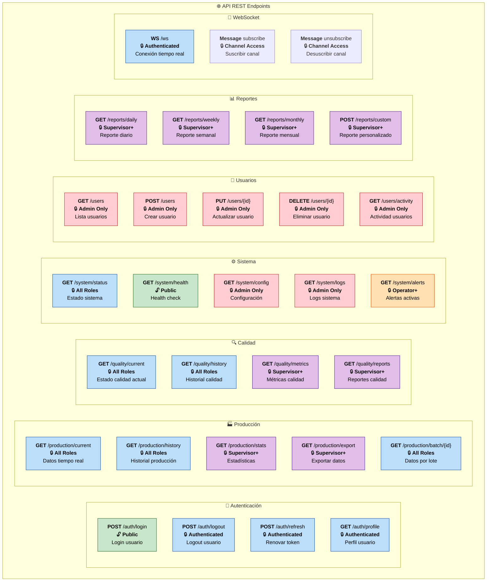

# 🌐 API REST Endpoints

## Descripción
Documentación completa de todos los endpoints de la API REST del sistema de producción, incluyendo autenticación, autorización y ejemplos de uso.

## Configuración Base API

### 🔧 Configuración General
- **Base URL**: `http://servidor:8000/api`
- **Protocolo**: HTTP/HTTPS
- **Formato**: JSON
- **Autenticación**: JWT Bearer Token
- **Versionado**: v1 (en URL path)
- **Rate Limiting**: 1000 requests/hora por usuario

### 📋 Headers Obligatorios
```http
Content-Type: application/json
Authorization: Bearer <jwt_token>
Accept: application/json
```

## Mapa de Endpoints



## Detalles de Endpoints

### 🔐 Autenticación

#### POST /auth/login
```http
POST /api/auth/login
Content-Type: application/json

{
  "username": "operador1",
  "password": "password123"
}
```

**Respuesta Exitosa (200):**
```json
{
  "access_token": "eyJ0eXAiOiJKV1QiLCJhbGciOiJIUzI1NiJ9...",
  "token_type": "bearer",
  "expires_in": 3600,
  "user": {
    "id": 1,
    "username": "operador1",
    "role": "operator",
    "full_name": "Juan Pérez",
    "permissions": ["production.read", "quality.read"]
  }
}
```

#### GET /auth/profile
```http
GET /api/auth/profile
Authorization: Bearer <token>
```

**Respuesta (200):**
```json
{
  "id": 1,
  "username": "operador1",
  "email": "operador1@empresa.com",
  "full_name": "Juan Pérez",
  "role": "operator",
  "is_active": true,
  "last_login": "2024-01-15T10:30:00Z",
  "permissions": [
    "production.read",
    "quality.read",
    "system.status"
  ]
}
```

### 🏭 Producción

#### GET /production/current
```http
GET /api/production/current
Authorization: Bearer <token>
```

**Respuesta (200):**
```json
{
  "timestamp": "2024-01-15T10:30:45Z",
  "current_production": {
    "id": 12345,
    "product_id": 2,
    "quality_status": "OK",
    "production_count": 1547,
    "line_status": "RUNNING",
    "cycle_time_ms": 2340,
    "temperature": 23.5,
    "pressure": 6.2,
    "batch_id": "BATCH_20240115_001",
    "operator_id": 1
  },
  "line_performance": {
    "efficiency": 94.2,
    "oee": 89.1,
    "quality_rate": 96.8,
    "availability": 98.5
  },
  "cameras": [
    {
      "camera_id": 1,
      "status": "OK",
      "last_result": "PASS",
      "confidence": 0.98
    },
    {
      "camera_id": 2,
      "status": "OK", 
      "last_result": "PASS",
      "confidence": 0.95
    }
  ]
}
```

#### GET /production/history
```http
GET /api/production/history?start_date=2024-01-01&end_date=2024-01-15&limit=100&offset=0
Authorization: Bearer <token>
```

**Parámetros Query:**
- `start_date`: Fecha inicio (ISO 8601)
- `end_date`: Fecha fin (ISO 8601)
- `product_id`: Filtrar por producto (opcional)
- `batch_id`: Filtrar por lote (opcional)
- `quality_status`: Filtrar por calidad (opcional)
- `limit`: Máximo registros (default: 50, max: 1000)
- `offset`: Paginación (default: 0)

**Respuesta (200):**
```json
{
  "total": 2547,
  "count": 100,
  "offset": 0,
  "records": [
    {
      "id": 12345,
      "timestamp": "2024-01-15T10:30:45Z",
      "product_id": 2,
      "quality_status": "OK",
      "production_count": 1547,
      "cycle_time_ms": 2340,
      "temperature": 23.5,
      "batch_id": "BATCH_20240115_001"
    }
  ],
  "pagination": {
    "has_next": true,
    "has_prev": false,
    "next_offset": 100,
    "prev_offset": null
  }
}
```

### 🔍 Calidad

#### GET /quality/metrics
```http
GET /api/quality/metrics?period=daily
Authorization: Bearer <token>
```

**Parámetros:**
- `period`: daily, weekly, monthly, yearly
- `start_date`: Fecha inicio (opcional)
- `end_date`: Fecha fin (opcional)

**Respuesta (200):**
```json
{
  "period": "daily",
  "date_range": {
    "start": "2024-01-15T00:00:00Z",
    "end": "2024-01-15T23:59:59Z"
  },
  "metrics": {
    "total_inspected": 1547,
    "passed": 1496,
    "failed": 51,
    "quality_rate": 96.7,
    "defect_types": {
      "dimensional": 23,
      "visual": 18,
      "surface": 10
    },
    "camera_performance": [
      {
        "camera_id": 1,
        "accuracy": 98.2,
        "false_positives": 2,
        "false_negatives": 1
      }
    ]
  },
  "trends": {
    "quality_trend": "stable",
    "improvement_rate": 2.1
  }
}
```

### ⚙️ Sistema

#### GET /system/status
```http
GET /api/system/status
Authorization: Bearer <token>
```

**Respuesta (200):**
```json
{
  "timestamp": "2024-01-15T10:30:45Z",
  "overall_status": "healthy",
  "components": {
    "modbus_server": {
      "status": "running",
      "last_communication": "2024-01-15T10:30:43Z",
      "connection_count": 1,
      "data_rate": "0.5 Hz"
    },
    "database": {
      "status": "healthy",
      "connections": 12,
      "query_time_avg": 45,
      "storage_used": "2.1 GB"
    },
    "websocket": {
      "status": "running",
      "active_connections": 8,
      "message_rate": "15/sec"
    },
    "api": {
      "status": "running",
      "requests_per_minute": 120,
      "avg_response_time": 150
    }
  },
  "alerts": [
    {
      "id": 1,
      "severity": "warning",
      "message": "CPU usage above 80%",
      "timestamp": "2024-01-15T10:25:00Z"
    }
  ]
}
```

#### GET /system/health
```http
GET /api/system/health
```

**Respuesta (200):**
```json
{
  "status": "healthy",
  "timestamp": "2024-01-15T10:30:45Z",
  "version": "1.0.0",
  "uptime": 86400,
  "checks": {
    "database": "ok",
    "modbus": "ok",
    "storage": "ok",
    "memory": "warning"
  }
}
```

### 👥 Gestión de Usuarios

#### GET /users
```http
GET /api/users?role=operator&is_active=true&limit=20
Authorization: Bearer <admin_token>
```

**Respuesta (200):**
```json
{
  "total": 15,
  "users": [
    {
      "id": 1,
      "username": "operador1",
      "email": "operador1@empresa.com",
      "full_name": "Juan Pérez",
      "role": "operator",
      "is_active": true,
      "last_login": "2024-01-15T09:00:00Z",
      "created_at": "2024-01-01T08:00:00Z"
    }
  ]
}
```

#### POST /users
```http
POST /api/users
Authorization: Bearer <admin_token>
Content-Type: application/json

{
  "username": "nuevo_operador",
  "email": "nuevo@empresa.com",
  "full_name": "Ana García",
  "role": "operator",
  "password": "temporal123",
  "is_active": true
}
```

**Respuesta (201):**
```json
{
  "id": 16,
  "username": "nuevo_operador",
  "email": "nuevo@empresa.com",
  "full_name": "Ana García",
  "role": "operator",
  "is_active": true,
  "created_at": "2024-01-15T10:30:45Z",
  "temporary_password": true
}
```

### 📊 Reportes

#### POST /reports/custom
```http
POST /api/reports/custom
Authorization: Bearer <supervisor_token>
Content-Type: application/json

{
  "report_type": "quality_analysis",
  "date_range": {
    "start": "2024-01-01T00:00:00Z",
    "end": "2024-01-15T23:59:59Z"
  },
  "filters": {
    "product_ids": [1, 2],
    "quality_status": ["OK", "NOK"],
    "batch_ids": ["BATCH_20240115_001"]
  },
  "format": "json",
  "include_charts": true
}
```

**Respuesta (200):**
```json
{
  "report_id": "rpt_20240115_001",
  "status": "completed",
  "generated_at": "2024-01-15T10:30:45Z",
  "download_url": "/api/reports/download/rpt_20240115_001",
  "expires_at": "2024-01-22T10:30:45Z",
  "summary": {
    "total_records": 5234,
    "time_range": "15 days",
    "products_analyzed": 2,
    "quality_rate": 96.2
  }
}
```

## Códigos de Estado HTTP

### ✅ Códigos de Éxito
- **200 OK**: Solicitud exitosa
- **201 Created**: Recurso creado exitosamente
- **204 No Content**: Operación exitosa sin contenido

### ⚠️ Códigos de Error Cliente
- **400 Bad Request**: Datos inválidos
- **401 Unauthorized**: Sin autenticación
- **403 Forbidden**: Sin permisos
- **404 Not Found**: Recurso no encontrado
- **422 Unprocessable Entity**: Error validación

### 🚨 Códigos de Error Servidor
- **500 Internal Server Error**: Error interno
- **502 Bad Gateway**: Error backend
- **503 Service Unavailable**: Servicio no disponible

## Autenticación JWT

### 🔑 Estructura Token
```json
{
  "header": {
    "typ": "JWT",
    "alg": "HS256"
  },
  "payload": {
    "user_id": 1,
    "username": "operador1",
    "role": "operator",
    "permissions": ["production.read", "quality.read"],
    "exp": 1705320645,
    "iat": 1705317045
  }
}
```

### 🔐 Niveles de Acceso

| Rol | Permisos | Endpoints Accesibles |
|-----|----------|---------------------|
| **Viewer** | Solo lectura básica | /production/current, /quality/current |
| **Operator** | Lectura + alertas | + /system/alerts, /production/history |
| **Supervisor** | + Reportes/Stats | + /quality/metrics, /reports/* |
| **Admin** | Control total | + /users/*, /system/config |

### ⏱️ Gestión de Tokens
- **Duración**: 1 hora
- **Refresh**: 24 horas
- **Auto-renovación**: 15 minutos antes expiración
- **Revocación**: Logout o cambio password

## Rate Limiting

### 📊 Límites por Rol
- **Viewer**: 100 req/hora
- **Operator**: 500 req/hora  
- **Supervisor**: 1000 req/hora
- **Admin**: 2000 req/hora

### 🚫 Headers de Rate Limit
```http
X-RateLimit-Limit: 1000
X-RateLimit-Remaining: 842
X-RateLimit-Reset: 1705320645
``` 