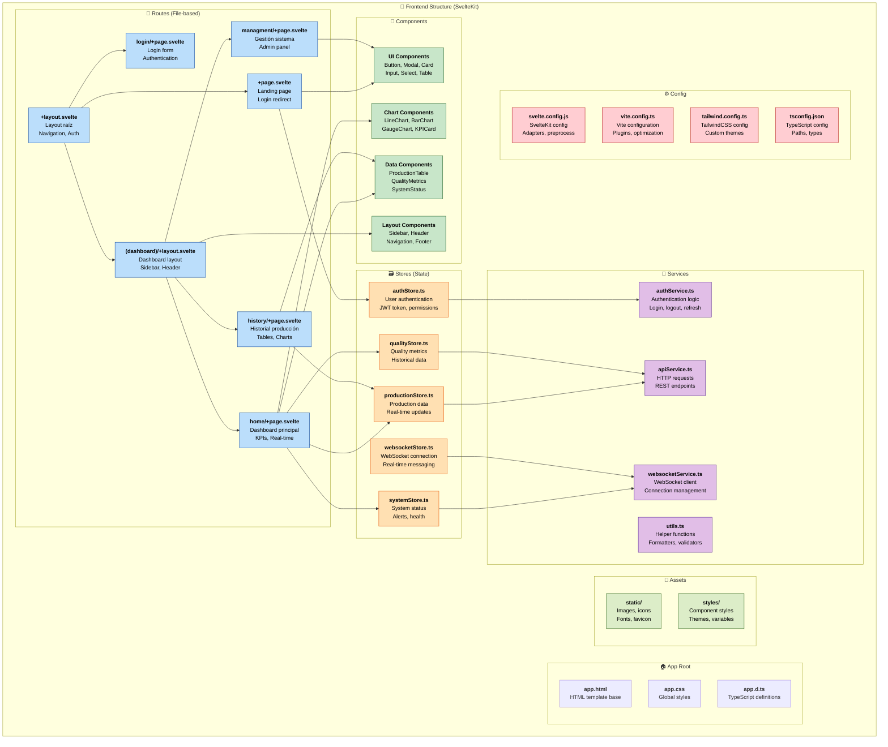

# 💻 Estructura Frontend SvelteKit

## Descripción
Diagrama completo de la estructura del frontend desarrollado en SvelteKit, mostrando la organización de páginas, componentes, stores y servicios.

## Tecnologías Utilizadas

### 🛠️ Stack Principal
- **Framework**: SvelteKit 2.16.0
- **UI Library**: Skeleton UI 3.1.0
- **CSS**: TailwindCSS 4.0.0
- **Icons**: Lucide Svelte
- **Charts**: Chart.js / D3.js
- **WebSocket**: Native WebSocket API
- **HTTP Client**: Fetch API + wrapping

### 📦 Dependencias
- **Build Tool**: Vite 5.0
- **TypeScript**: 5.3
- **ESLint**: 9.0
- **Package Manager**: pnpm

## Estructura de Archivos



## Detalles de Implementación

### 🏠 App Layout Structure

#### app.html (Template Base)
```html
<!DOCTYPE html>
<html lang="es" class="%sveltekit.theme%">
<head>
    <meta charset="utf-8" />
    <link rel="icon" href="%sveltekit.assets%/favicon.svg" />
    <meta name="viewport" content="width=device-width, initial-scale=1" />
    <title>Sistema de Producción Industrial</title>
    %sveltekit.head%
</head>
<body data-sveltekit-preload-data="hover" class="bg-surface-50-900-token">
    <div style="display: contents" class="h-full overflow-hidden">
        %sveltekit.body%
    </div>
</body>
</html>
```

#### +layout.svelte (Root Layout)
```svelte
<script lang="ts">
    import '../app.css';
    import { onMount } from 'svelte';
    import { authStore } from '$lib/stores/authStore';
    import { websocketStore } from '$lib/stores/websocketStore';
    import Navigation from '$lib/components/Navigation.svelte';
    import { Toast } from '@skeletonlabs/skeleton';

    onMount(() => {
        // Initialize authentication
        authStore.checkAuthStatus();
        
        // Initialize WebSocket if authenticated
        authStore.subscribe(auth => {
            if (auth.isAuthenticated) {
                websocketStore.connect();
            }
        });
    });
</script>

<Navigation />

<main class="container mx-auto p-4">
    <slot />
</main>

<Toast />
```

### 📄 Page Components

#### (dashboard)/home/+page.svelte
```svelte
<script lang="ts">
    import { onMount } from 'svelte';
    import { productionStore } from '$lib/stores/productionStore';
    import { qualityStore } from '$lib/stores/qualityStore';
    import KPICard from '$lib/components/KPICard.svelte';
    import LineChart from '$lib/components/charts/LineChart.svelte';
    import ProductionTable from '$lib/components/ProductionTable.svelte';
    
    onMount(() => {
        // Load initial data
        productionStore.fetchCurrent();
        qualityStore.fetchCurrent();
    });
    
    $: production = $productionStore;
    $: quality = $qualityStore;
</script>

<div class="space-y-6">
    <!-- KPI Cards Row -->
    <div class="grid grid-cols-1 md:grid-cols-4 gap-4">
        <KPICard 
            title="Producción Actual" 
            value={production.current?.production_count || 0}
            unit="pcs"
            trend="up" />
        <KPICard 
            title="Calidad" 
            value={quality.current?.quality_rate || 0}
            unit="%"
            trend="stable" />
        <KPICard 
            title="Eficiencia" 
            value={production.current?.efficiency || 0}
            unit="%"
            trend="up" />
        <KPICard 
            title="Estado Línea" 
            value={production.current?.line_status || "UNKNOWN"}
            status="running" />
    </div>
    
    <!-- Charts Row -->
    <div class="grid grid-cols-1 lg:grid-cols-2 gap-6">
        <div class="card p-4">
            <h3 class="h3 mb-4">Producción en Tiempo Real</h3>
            <LineChart 
                data={production.history}
                xField="timestamp"
                yField="production_count" />
        </div>
        
        <div class="card p-4">
            <h3 class="h3 mb-4">Calidad por Hora</h3>
            <LineChart 
                data={quality.history}
                xField="timestamp"
                yField="quality_rate" />
        </div>
    </div>
    
    <!-- Data Table -->
    <div class="card p-4">
        <h3 class="h3 mb-4">Registros Recientes</h3>
        <ProductionTable data={production.recent} />
    </div>
</div>
```

### 🗃️ Stores (Reactive State)

#### productionStore.ts
```typescript
import { writable, derived } from 'svelte/store';
import { apiService } from '$lib/services/apiService';
import type { ProductionRecord, ProductionStats } from '$lib/types';

interface ProductionState {
    current: ProductionRecord | null;
    history: ProductionRecord[];
    stats: ProductionStats | null;
    loading: boolean;
    error: string | null;
}

const initialState: ProductionState = {
    current: null,
    history: [],
    stats: null,
    loading: false,
    error: null
};

function createProductionStore() {
    const { subscribe, set, update } = writable<ProductionState>(initialState);
    
    return {
        subscribe,
        
        async fetchCurrent() {
            update(state => ({ ...state, loading: true, error: null }));
            try {
                const current = await apiService.get<ProductionRecord>('/production/current');
                update(state => ({ ...state, current, loading: false }));
            } catch (error) {
                update(state => ({ 
                    ...state, 
                    error: error.message, 
                    loading: false 
                }));
            }
        },
        
        async fetchHistory(filters?: any) {
            update(state => ({ ...state, loading: true }));
            try {
                const history = await apiService.get<ProductionRecord[]>('/production/history', filters);
                update(state => ({ ...state, history, loading: false }));
            } catch (error) {
                update(state => ({ 
                    ...state, 
                    error: error.message, 
                    loading: false 
                }));
            }
        },
        
        updateCurrent(data: ProductionRecord) {
            update(state => ({ ...state, current: data }));
        },
        
        reset() {
            set(initialState);
        }
    };
}

export const productionStore = createProductionStore();

// Derived stores for computed values
export const productionMetrics = derived(
    productionStore,
    $production => ({
        efficiency: $production.current?.efficiency || 0,
        quality_rate: $production.current?.quality_rate || 0,
        oee: $production.current?.oee || 0
    })
);
```

#### websocketStore.ts
```typescript
import { writable } from 'svelte/store';
import { authStore } from './authStore';
import { productionStore } from './productionStore';
import { qualityStore } from './qualityStore';

interface WebSocketState {
    connected: boolean;
    connecting: boolean;
    error: string | null;
    lastMessage: any;
}

function createWebSocketStore() {
    const { subscribe, set, update } = writable<WebSocketState>({
        connected: false,
        connecting: false,
        error: null,
        lastMessage: null
    });
    
    let ws: WebSocket | null = null;
    let reconnectTimer: number | null = null;
    
    return {
        subscribe,
        
        connect() {
            if (ws?.readyState === WebSocket.OPEN) return;
            
            update(state => ({ ...state, connecting: true, error: null }));
            
            const token = authStore.getToken();
            const wsUrl = `ws://localhost:8000/ws?token=${token}`;
            
            ws = new WebSocket(wsUrl);
            
            ws.onopen = () => {
                update(state => ({ 
                    ...state, 
                    connected: true, 
                    connecting: false 
                }));
                console.log('WebSocket connected');
            };
            
            ws.onmessage = (event) => {
                const message = JSON.parse(event.data);
                
                update(state => ({ ...state, lastMessage: message }));
                
                // Route messages to appropriate stores
                switch (message.type) {
                    case 'production_update':
                        productionStore.updateCurrent(message.data);
                        break;
                    case 'quality_update':
                        qualityStore.updateCurrent(message.data);
                        break;
                    case 'system_alert':
                        // Handle system alerts
                        break;
                }
            };
            
            ws.onclose = () => {
                update(state => ({ 
                    ...state, 
                    connected: false, 
                    connecting: false 
                }));
                
                // Auto-reconnect after 3 seconds
                reconnectTimer = setTimeout(() => {
                    this.connect();
                }, 3000);
            };
            
            ws.onerror = (error) => {
                update(state => ({ 
                    ...state, 
                    error: 'WebSocket error', 
                    connecting: false 
                }));
            };
        },
        
        disconnect() {
            if (reconnectTimer) {
                clearTimeout(reconnectTimer);
                reconnectTimer = null;
            }
            
            if (ws) {
                ws.close();
                ws = null;
            }
            
            set({
                connected: false,
                connecting: false,
                error: null,
                lastMessage: null
            });
        },
        
        send(message: any) {
            if (ws?.readyState === WebSocket.OPEN) {
                ws.send(JSON.stringify(message));
            }
        }
    };
}

export const websocketStore = createWebSocketStore();
```

### 🔧 Services

#### apiService.ts
```typescript
import { authStore } from '$lib/stores/authStore';

class APIService {
    private baseURL = 'http://localhost:8000/api';
    
    private async request<T>(
        endpoint: string, 
        options: RequestInit = {}
    ): Promise<T> {
        const token = authStore.getToken();
        
        const config: RequestInit = {
            headers: {
                'Content-Type': 'application/json',
                ...(token && { Authorization: `Bearer ${token}` }),
                ...options.headers
            },
            ...options
        };
        
        const response = await fetch(`${this.baseURL}${endpoint}`, config);
        
        if (!response.ok) {
            if (response.status === 401) {
                authStore.logout();
                throw new Error('Session expired');
            }
            throw new Error(`HTTP ${response.status}: ${response.statusText}`);
        }
        
        return response.json();
    }
    
    async get<T>(endpoint: string, params?: Record<string, any>): Promise<T> {
        const url = new URL(`${this.baseURL}${endpoint}`);
        if (params) {
            Object.entries(params).forEach(([key, value]) => {
                if (value !== undefined) {
                    url.searchParams.append(key, String(value));
                }
            });
        }
        
        return this.request<T>(url.pathname + url.search);
    }
    
    async post<T>(endpoint: string, data?: any): Promise<T> {
        return this.request<T>(endpoint, {
            method: 'POST',
            body: data ? JSON.stringify(data) : undefined
        });
    }
    
    async put<T>(endpoint: string, data?: any): Promise<T> {
        return this.request<T>(endpoint, {
            method: 'PUT',
            body: data ? JSON.stringify(data) : undefined
        });
    }
    
    async delete<T>(endpoint: string): Promise<T> {
        return this.request<T>(endpoint, {
            method: 'DELETE'
        });
    }
}

export const apiService = new APIService();
```

### 🧩 UI Components

#### KPICard.svelte
```svelte
<script lang="ts">
    export let title: string;
    export let value: string | number;
    export let unit: string = '';
    export let trend: 'up' | 'down' | 'stable' = 'stable';
    export let status: 'running' | 'stopped' | 'error' | 'warning' = 'running';
    
    const trendIcons = {
        up: '↗️',
        down: '↘️',
        stable: '➡️'
    };
    
    const statusColors = {
        running: 'variant-filled-success',
        stopped: 'variant-filled-surface',
        error: 'variant-filled-error',
        warning: 'variant-filled-warning'
    };
</script>

<div class="card p-4 bg-surface-100-800-token">
    <div class="flex justify-between items-start mb-2">
        <h4 class="h4 text-surface-600-300-token">{title}</h4>
        <span class="text-lg">{trendIcons[trend]}</span>
    </div>
    
    <div class="flex items-baseline space-x-2">
        <span class="text-3xl font-bold text-primary-600-300-token">
            {typeof value === 'number' ? value.toLocaleString() : value}
        </span>
        {#if unit}
            <span class="text-sm text-surface-500-400-token">{unit}</span>
        {/if}
    </div>
    
    {#if status !== 'running'}
        <div class="mt-2">
            <span class="badge {statusColors[status]} text-xs">
                {status.toUpperCase()}
            </span>
        </div>
    {/if}
</div>
```

## Configuración y Build

### 📦 package.json
```json
{
  "name": "tester-app-front",
  "version": "1.0.0",
  "scripts": {
    "dev": "vite dev --host 0.0.0.0 --port 3000",
    "build": "vite build",
    "preview": "vite preview",
    "check": "svelte-kit sync && svelte-check --tsconfig ./tsconfig.json",
    "check:watch": "svelte-kit sync && svelte-check --tsconfig ./tsconfig.json --watch",
    "lint": "eslint ."
  },
  "dependencies": {
    "@skeletonlabs/skeleton": "^3.1.0",
    "lucide-svelte": "^0.300.0",
    "chart.js": "^4.4.0"
  },
  "devDependencies": {
    "@sveltejs/adapter-node": "^2.0.0",
    "@sveltejs/kit": "^2.16.0",
    "svelte": "^5.0.0",
    "typescript": "^5.3.0",
    "vite": "^5.0.0",
    "tailwindcss": "^4.0.0"
  },
  "type": "module"
}
```

### ⚙️ svelte.config.js
```javascript
import adapter from '@sveltejs/adapter-node';
import { vitePreprocess } from '@sveltejs/vite-plugin-svelte';

const config = {
    preprocess: vitePreprocess(),
    
    kit: {
        adapter: adapter({
            out: 'build',
            precompress: true,
            envPrefix: 'PUBLIC_'
        }),
        alias: {
            $lib: './src/lib'
        }
    }
};

export default config;
```

## Deployment en Servidor

### 🚀 Build y Deploy
```bash
# Build de producción
npm run build

# Servir aplicación
node build/index.js

# Variables de entorno
export PUBLIC_API_URL=http://localhost:8000
export PUBLIC_WS_URL=ws://localhost:8000
export PORT=3000
```

### 🔧 Nginx Configuration (Opcional)
```nginx
server {
    listen 80;
    server_name production-frontend.local;
    
    location / {
        proxy_pass http://localhost:3000;
        proxy_http_version 1.1;
        proxy_set_header Upgrade $http_upgrade;
        proxy_set_header Connection 'upgrade';
        proxy_set_header Host $host;
        proxy_cache_bypass $http_upgrade;
    }
    
    location /ws {
        proxy_pass http://localhost:8000;
        proxy_http_version 1.1;
        proxy_set_header Upgrade $http_upgrade;
        proxy_set_header Connection "upgrade";
    }
}
``` 