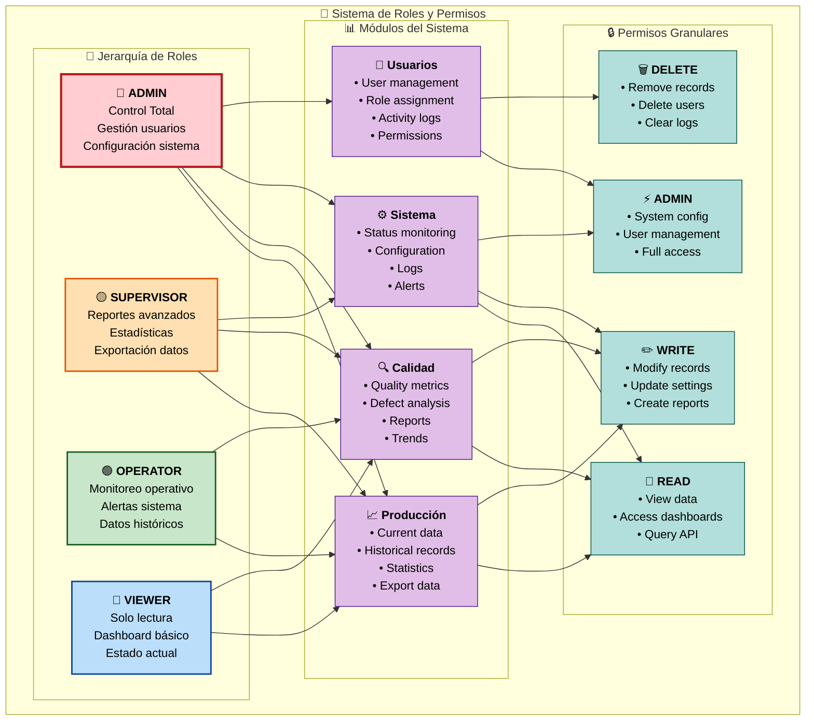

# 👤 Roles de Usuario y Autenticación

## Descripción
Sistema completo de autenticación y autorización con JWT, incluyendo 4 roles de usuario con diferentes niveles de acceso y permisos granulares.

## Modelo de Seguridad

### 🔐 Arquitectura de Autenticación
- **Protocolo**: JWT (JSON Web Tokens)
- **Algoritmo**: HS256 (HMAC SHA-256)
- **Duración Token**: 1 hora
- **Refresh Token**: 24 horas
- **Almacenamiento**: HTTP-only cookies + localStorage
- **Encriptación Passwords**: bcrypt con salt rounds 12

## Diagrama de Roles y Permisos



## Flujo de Autenticación

```mermaid
sequenceDiagram
    participant User as 👤 Usuario
    participant Frontend as 💻 Frontend
    participant API as 🌐 API Gateway
    participant Auth as 🔐 Auth Service
    participant DB as 🗄️ Database
    participant JWT as 🎫 JWT Service

    Note over User, JWT: 🔐 Proceso de Login
    User->>+Frontend: Credenciales (username/password)
    Frontend->>+API: POST /auth/login
    API->>+Auth: Validar credenciales
    Auth->>+DB: SELECT user WHERE username
    DB-->>-Auth: User data + hashed_password
    
    Auth->>Auth: bcrypt.compare(password, hash)
    
    alt Credenciales válidas
        Auth->>+JWT: Generar tokens
        JWT-->>-Auth: access_token + refresh_token
        Auth->>+DB: UPDATE last_login
        DB-->>-Auth: OK
        Auth-->>-API: Tokens + user data
        API-->>-Frontend: 200 OK + tokens
        Frontend->>Frontend: Almacenar tokens
        Frontend-->>-User: ✅ Login exitoso
        
        Note over Frontend: Auto-setup WebSocket + API headers
    
    else Credenciales inválidas
        Auth-->>-API: 401 Unauthorized
        API-->>-Frontend: Error response
        Frontend-->>-User: ❌ Error de login
    end
    
    Note over User, JWT: 🔄 Refresh de Token
    loop Cada 45 minutos
        Frontend->>+API: POST /auth/refresh
        API->>+JWT: Validar refresh_token
        JWT->>JWT: Verificar expiración
        JWT-->>-API: Nuevo access_token
        API-->>-Frontend: 200 OK + nuevo token
        Frontend->>Frontend: Actualizar token almacenado
    end
    
    Note over User, JWT: 🚪 Logout
    User->>+Frontend: Logout request
    Frontend->>+API: POST /auth/logout
    API->>+Auth: Invalidar tokens
    Auth->>+DB: INSERT audit_log (logout)
    DB-->>-Auth: OK
    Auth-->>-API: Logout OK
    API-->>-Frontend: 200 OK
    Frontend->>Frontend: Limpiar tokens
    Frontend-->>-User: ✅ Logout completado
```

## Matriz de Permisos Detallada

### 📊 Permisos por Rol y Recurso

| Recurso | Acción | Viewer | Operator | Supervisor | Admin |
|---------|--------|--------|----------|------------|-------|
| **Producción** | Ver datos actuales | ✅ | ✅ | ✅ | ✅ |
| **Producción** | Ver historial | ❌ | ✅ | ✅ | ✅ |
| **Producción** | Ver estadísticas | ❌ | ❌ | ✅ | ✅ |
| **Producción** | Exportar datos | ❌ | ❌ | ✅ | ✅ |
| **Calidad** | Ver métricas actuales | ✅ | ✅ | ✅ | ✅ |
| **Calidad** | Ver análisis detallado | ❌ | ✅ | ✅ | ✅ |
| **Calidad** | Generar reportes | ❌ | ❌ | ✅ | ✅ |
| **Calidad** | Configurar límites | ❌ | ❌ | ❌ | ✅ |
| **Sistema** | Ver estado general | ✅ | ✅ | ✅ | ✅ |
| **Sistema** | Ver alertas | ❌ | ✅ | ✅ | ✅ |
| **Sistema** | Ver logs | ❌ | ❌ | ✅ | ✅ |
| **Sistema** | Configuración | ❌ | ❌ | ❌ | ✅ |
| **Usuarios** | Ver perfil propio | ✅ | ✅ | ✅ | ✅ |
| **Usuarios** | Gestionar usuarios | ❌ | ❌ | ❌ | ✅ |
| **Usuarios** | Ver actividad | ❌ | ❌ | ❌ | ✅ |

### 🔐 Códigos de Permisos

```typescript
// Definición de permisos granulares
enum Permission {
  // Producción
  PRODUCTION_READ = 'production.read',
  PRODUCTION_WRITE = 'production.write',
  PRODUCTION_STATS = 'production.stats',
  PRODUCTION_EXPORT = 'production.export',
  
  // Calidad
  QUALITY_READ = 'quality.read',
  QUALITY_WRITE = 'quality.write',
  QUALITY_REPORTS = 'quality.reports',
  QUALITY_CONFIG = 'quality.config',
  
  // Sistema
  SYSTEM_READ = 'system.read',
  SYSTEM_WRITE = 'system.write',
  SYSTEM_CONFIG = 'system.config',
  SYSTEM_LOGS = 'system.logs',
  
  // Usuarios
  USERS_READ = 'users.read',
  USERS_WRITE = 'users.write',
  USERS_DELETE = 'users.delete',
  USERS_ADMIN = 'users.admin'
}

// Asignación de permisos por rol
const rolePermissions = {
  viewer: [
    Permission.PRODUCTION_READ,
    Permission.QUALITY_READ,
    Permission.SYSTEM_READ
  ],
  
  operator: [
    Permission.PRODUCTION_READ,
    Permission.QUALITY_READ,
    Permission.SYSTEM_READ,
    Permission.SYSTEM_WRITE // Para alertas
  ],
  
  supervisor: [
    Permission.PRODUCTION_READ,
    Permission.PRODUCTION_STATS,
    Permission.PRODUCTION_EXPORT,
    Permission.QUALITY_READ,
    Permission.QUALITY_REPORTS,
    Permission.SYSTEM_READ,
    Permission.SYSTEM_WRITE,
    Permission.SYSTEM_LOGS
  ],
  
  admin: [
    ...Object.values(Permission) // Todos los permisos
  ]
};
```

## Implementación JWT

### 🎫 Estructura del Token

```json
{
  "header": {
    "typ": "JWT",
    "alg": "HS256"
  },
  "payload": {
    "user_id": 12,
    "username": "operador1",
    "email": "operador1@empresa.com",
    "role": "operator",
    "permissions": [
      "production.read",
      "quality.read",
      "system.read",
      "system.write"
    ],
    "iat": 1705317045,
    "exp": 1705320645,
    "session_id": "sess_20240115_001"
  }
}
```

### 🔧 Configuración Backend (Python)

```python
# JWT Configuration
JWT_SECRET_KEY = "your-256-bit-secret-key"
JWT_ALGORITHM = "HS256"
JWT_ACCESS_TOKEN_EXPIRE = 3600  # 1 hour
JWT_REFRESH_TOKEN_EXPIRE = 86400  # 24 hours

# Password hashing
BCRYPT_ROUNDS = 12

# Auth Service Implementation
from passlib.context import CryptContext
from jose import JWTError, jwt
from datetime import datetime, timedelta

pwd_context = CryptContext(schemes=["bcrypt"], deprecated="auto")

def verify_password(plain_password: str, hashed_password: str) -> bool:
    return pwd_context.verify(plain_password, hashed_password)

def get_password_hash(password: str) -> str:
    return pwd_context.hash(password)

def create_access_token(data: dict) -> str:
    to_encode = data.copy()
    expire = datetime.utcnow() + timedelta(seconds=JWT_ACCESS_TOKEN_EXPIRE)
    to_encode.update({"exp": expire, "type": "access"})
    return jwt.encode(to_encode, JWT_SECRET_KEY, algorithm=JWT_ALGORITHM)

def create_refresh_token(data: dict) -> str:
    to_encode = data.copy()
    expire = datetime.utcnow() + timedelta(seconds=JWT_REFRESH_TOKEN_EXPIRE)
    to_encode.update({"exp": expire, "type": "refresh"})
    return jwt.encode(to_encode, JWT_SECRET_KEY, algorithm=JWT_ALGORITHM)

async def authenticate_user(username: str, password: str) -> User | None:
    user = await get_user_by_username(username)
    if not user or not verify_password(password, user.hashed_password):
        return None
    return user
```

### 🔒 Middleware de Autorización

```python
from fastapi import HTTPException, Depends, status
from fastapi.security import HTTPBearer
from jose import JWTError, jwt

security = HTTPBearer()

async def get_current_user(token: str = Depends(security)) -> User:
    credentials_exception = HTTPException(
        status_code=status.HTTP_401_UNAUTHORIZED,
        detail="Could not validate credentials",
        headers={"WWW-Authenticate": "Bearer"},
    )
    
    try:
        payload = jwt.decode(token.credentials, JWT_SECRET_KEY, algorithms=[JWT_ALGORITHM])
        username: str = payload.get("username")
        if username is None:
            raise credentials_exception
            
        user = await get_user_by_username(username)
        if user is None:
            raise credentials_exception
            
        return user
        
    except JWTError:
        raise credentials_exception

def require_permission(permission: str):
    def permission_checker(current_user: User = Depends(get_current_user)):
        if permission not in current_user.permissions:
            raise HTTPException(
                status_code=status.HTTP_403_FORBIDDEN,
                detail=f"Permission '{permission}' required"
            )
        return current_user
    return permission_checker

# Uso en endpoints
@app.get("/api/production/stats")
async def get_production_stats(
    user: User = Depends(require_permission("production.stats"))
):
    return await get_production_statistics()
```

## Gestión de Sesiones

### 📊 Tracking de Sesiones

```sql
-- Tabla de sesiones activas
CREATE TABLE user_sessions (
    id SERIAL PRIMARY KEY,
    user_id INTEGER REFERENCES users(id),
    session_id VARCHAR(50) UNIQUE NOT NULL,
    refresh_token_hash VARCHAR(255) NOT NULL,
    ip_address INET,
    user_agent TEXT,
    created_at TIMESTAMP DEFAULT NOW(),
    expires_at TIMESTAMP NOT NULL,
    is_active BOOLEAN DEFAULT true
);

-- Índices para performance
CREATE INDEX idx_user_sessions_user_id ON user_sessions(user_id);
CREATE INDEX idx_user_sessions_session_id ON user_sessions(session_id);
CREATE INDEX idx_user_sessions_expires_at ON user_sessions(expires_at);
```

### 🔄 Rotación de Tokens

```python
async def refresh_access_token(refresh_token: str) -> dict:
    try:
        payload = jwt.decode(refresh_token, JWT_SECRET_KEY, algorithms=[JWT_ALGORITHM])
        
        if payload.get("type") != "refresh":
            raise HTTPException(status_code=401, detail="Invalid token type")
            
        session_id = payload.get("session_id")
        session = await get_active_session(session_id)
        
        if not session or session.expires_at < datetime.utcnow():
            raise HTTPException(status_code=401, detail="Session expired")
            
        user = await get_user_by_id(session.user_id)
        
        # Generar nuevo access token
        new_access_token = create_access_token({
            "user_id": user.id,
            "username": user.username,
            "role": user.role,
            "permissions": user.permissions,
            "session_id": session_id
        })
        
        return {
            "access_token": new_access_token,
            "token_type": "bearer",
            "expires_in": JWT_ACCESS_TOKEN_EXPIRE
        }
        
    except JWTError:
        raise HTTPException(status_code=401, detail="Invalid refresh token")
```

## Seguridad Adicional

### 🛡️ Medidas de Protección

#### Rate Limiting por Rol
```python
from slowapi import Limiter, _rate_limit_exceeded_handler
from slowapi.util import get_remote_address

limiter = Limiter(key_func=get_remote_address)

# Límites por rol
RATE_LIMITS = {
    "viewer": "100/hour",
    "operator": "500/hour", 
    "supervisor": "1000/hour",
    "admin": "2000/hour"
}

@app.post("/api/auth/login")
@limiter.limit("5/minute")  # Límite estricto para login
async def login(request: Request, credentials: UserCredentials):
    # ... lógica de login
```

#### Validación de IP y Device
```python
async def validate_session_security(
    request: Request, 
    current_user: User = Depends(get_current_user)
):
    session_id = get_session_id_from_token(request)
    session = await get_session(session_id)
    
    # Verificar IP si está configurado
    if session.ip_address and session.ip_address != request.client.host:
        await log_security_event("IP_MISMATCH", current_user.id)
        raise HTTPException(status_code=401, detail="Session security violation")
    
    # Verificar User-Agent básico
    if session.user_agent and session.user_agent != request.headers.get("user-agent"):
        await log_security_event("DEVICE_CHANGE", current_user.id)
        # Opcionalmente requerir re-autenticación
```

### 📝 Auditoría de Seguridad

```sql
-- Eventos de seguridad
CREATE TABLE security_events (
    id SERIAL PRIMARY KEY,
    user_id INTEGER REFERENCES users(id),
    event_type VARCHAR(50) NOT NULL, -- LOGIN, LOGOUT, TOKEN_REFRESH, PERMISSION_DENIED
    ip_address INET,
    user_agent TEXT,
    success BOOLEAN NOT NULL,
    details JSONB,
    timestamp TIMESTAMP DEFAULT NOW()
);

-- Ejemplo de inserción
INSERT INTO security_events (user_id, event_type, ip_address, success, details)
VALUES (1, 'LOGIN_ATTEMPT', '192.168.1.100', false, '{"reason": "invalid_password"}');
``` 