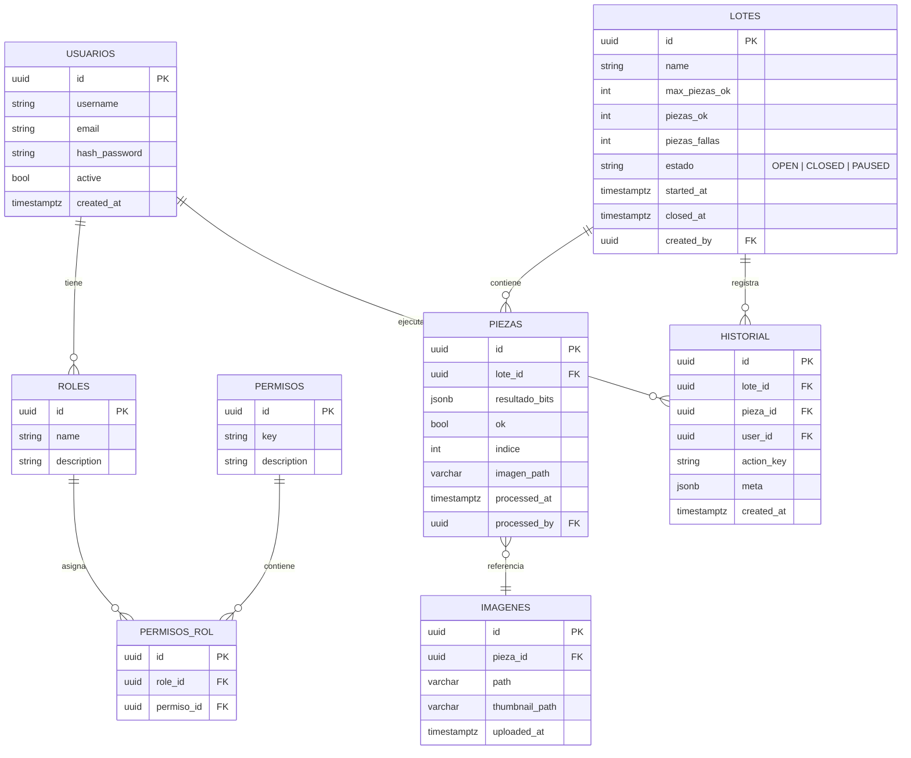

# DOCUMENTO MAESTRO — Sistema de Tests en Tiempo Real (SvelteKit)

> **Propósito:** documento técnico maestro para el equipo. Contiene: visión, arquitectura, modelo de datos, contratos (endpoints y eventos), flujo de desarrollo, scripts de inicialización, consideraciones de concurrencia y seguridad, y un runbook operativo.

---

## 1 — Resumen ejecutivo

Este proyecto es un **monolito LAN** que recibe resultados de pruebas desde un PLC, procesa cada pieza como parte de un **lote**, almacena resultados e imágenes (FTP), notifica al frontend en **tiempo real** y controla el PLC (p. ej. señal de detener cuando el lote alcanzó su meta). El objetivo es un MVP funcional y robusto: trazabilidad completa (historial), roles y permisos, UI operativa y confiabilidad en la lógica de lotes.

**Stack propuesto:** SvelteKit 2 + Skeleton UI, Node.js integrado, PostgreSQL + Prisma, autenticación con Lucia (adaptador Prisma), WebSockets (socket.io preferido por facilidad), `basic-ftp` para FTP.

---

## 2 — Requisitos funcionales y no funcionales

### Funcionales

* Recepción de arrays de bits por PLC: p. ej. `[0,0,0,1,0,1]`.
* Registro de cada pieza y su resultado dentro de un lote.
* Lotes con `max_piezas_ok` que, al cumplirse, cierran el lote y envían señal al PLC para detener nuevas ejecuciones.
* Historial/auditoría de acciones (quién hizo qué y cuándo).
* Roles y permisos personalizables (visor, operador, editor, admin y roles custom).
* Visualización en tiempo real en frontend mediante WebSockets.
* Lectura de imágenes desde servidor FTP y proxy seguro por el backend.

### No funcionales

* Latencia de notificación: < 300ms (ideal <100ms) desde que se procesa la pieza hasta que el front recibe el evento.
* Alta confiabilidad en conteo de piezas (evitar doble conteo por reenvíos del PLC).
* Seguridad: sesiones HTTP-only, verificación de permisos en endpoints y sockets, protección de endpoints FTP.
* Operabilidad: fácil seed inicial, logs accesibles y runbook para arrancar en planta.

---

## 3 — Arquitectura (diagrama)

```mermaid
flowchart LR
  PLC[PLC]
  PLCAdapter[PLC Adapter
(Modbus/TCP or TCP listener)]
  UseCases[Use Cases / Application
(registrarPieza, cerrarLote...) ]
  Repos[Repos (Prisma)]
  WSHub[WebSocket Hub (socket.io)]
  FTPAdapter[FTP Adapter]
  Frontend[SvelteKit + SkeletonUI]
  Hooks[hooks.server.ts
(Auth & permissions)]
  Signals[Queue/Buffer]

  PLC --> PLCAdapter --> Signals --> UseCases
  UseCases --> Repos
  UseCases --> WSHub --> Frontend
  UseCases --> PLCAdapter:::control
  FTPAdapter --> Repos
  Frontend --> Hooks --> UseCases

  classDef control stroke:#f66,stroke-width:2px
```

**Notas:**

* `PLCAdapter` normaliza el paquete entrante y delega a un caso de uso.
* `Signals` actúa como buffer/batcher si el PLC emite ráfagas.
* `UseCases` son el corazón de la lógica: atómicos y testeables.
* `WSHub` mantiene las conexiones socket y asegura autenticación por handshake.

---

## 4 — Modelo de datos (ER) y esquema

**ER actualizado:**



### 4.1 — Prisma schema (versión actualizada)

```prisma
generator client {
  provider = "prisma-client-js"
}

datasource db {
  provider = "postgresql"
  url      = env("DATABASE_URL")
}

model Usuario {
  id           String   @id @default(uuid())
  luciaId      String?  @unique
  username     String   @unique
  email        String   @unique
  hashPassword String   @map("hash_password")
  active       Boolean  @default(true)
  createdAt    DateTime @default(now()) @map("created_at")
  
  // Relaciones
  roles        UsuarioRol[]
  historial    Historial[]
  lotesCreados Lote[]      @relation("LoteCreator")
  piezasProcesadas Pieza[] @relation("PiezaProcessor")

  @@map("usuarios")
}

model Rol {
  id          String @id @default(uuid())
  name        String @unique
  description String?
  
  // Relaciones
  permisos PermisosRol[]
  usuarios UsuarioRol[]

  @@map("roles")
}

model Permiso {
  id          String @id @default(uuid())
  key         String @unique
  description String?
  
  // Relaciones
  roles PermisosRol[]

  @@map("permisos")
}

model PermisosRol {
  id        String @id @default(uuid())
  roleId    String @map("role_id")
  permisoId String @map("permiso_id")
  
  // Relaciones
  rol     Rol     @relation(fields: [roleId], references: [id], onDelete: Cascade)
  permiso Permiso @relation(fields: [permisoId], references: [id], onDelete: Cascade)

  @@unique([roleId, permisoId])
  @@map("permisos_rol")
}

model UsuarioRol {
  id        String @id @default(uuid())
  usuarioId String @map("usuario_id")
  rolId     String @map("rol_id")
  
  // Relaciones
  usuario Usuario @relation(fields: [usuarioId], references: [id], onDelete: Cascade)
  rol     Rol     @relation(fields: [rolId], references: [id], onDelete: Cascade)
  
  @@unique([usuarioId, rolId])
  @@map("usuarios_roles")
}

model Lote {
  id           String    @id @default(uuid())
  name         String?
  maxPiezasOk  Int       @default(100) @map("max_piezas_ok")
  piezasOk     Int       @default(0) @map("piezas_ok")
  piezasFallas Int       @default(0) @map("piezas_fallas")
  estado       String    @default("OPEN") // OPEN | CLOSED | PAUSED
  startedAt    DateTime  @default(now()) @map("started_at")
  closedAt     DateTime? @map("closed_at")
  createdBy    String?   @map("created_by")
  
  // Relaciones
  creator   Usuario?    @relation("LoteCreator", fields: [createdBy], references: [id])
  piezas    Pieza[]
  historial Historial[]

  @@index([estado])
  @@index([startedAt])
  @@map("lotes")
}

model Pieza {
  id            String   @id @default(uuid())
  loteId        String   @map("lote_id")
  resultadoBits Json     @map("resultado_bits")
  ok            Boolean
  indice        Int?
  imagenPath    String?  @map("imagen_path") @db.VarChar(255)
  processedAt   DateTime @default(now()) @map("processed_at")
  processedBy   String?  @map("processed_by")
  
  // Relaciones
  lote      Lote      @relation(fields: [loteId], references: [id], onDelete: Cascade)
  processor Usuario?  @relation("PiezaProcessor", fields: [processedBy], references: [id])
  imagenes  Imagen[]
  historial Historial[]

  @@index([loteId])
  @@index([processedAt])
  @@index([ok])
  @@map("piezas")
}

model Imagen {
  id            String   @id @default(uuid())
  piezaId       String   @map("pieza_id")
  path          String   @db.VarChar(500)
  thumbnailPath String?  @map("thumbnail_path") @db.VarChar(500)
  uploadedAt    DateTime @default(now()) @map("uploaded_at")
  
  // Relaciones
  pieza Pieza @relation(fields: [piezaId], references: [id], onDelete: Cascade)

  @@index([piezaId])
  @@map("imagenes")
}

model Historial {
  id        String   @id @default(uuid())
  loteId    String?  @map("lote_id")
  piezaId   String?  @map("pieza_id")
  userId    String?  @map("user_id")
  actionKey String   @map("action_key")
  meta      Json?
  createdAt DateTime @default(now()) @map("created_at")
  
  // Relaciones
  lote  Lote?    @relation(fields: [loteId], references: [id])
  pieza Pieza?   @relation(fields: [piezaId], references: [id])
  user  Usuario? @relation(fields: [userId], references: [id])

  @@index([loteId])
  @@index([piezaId])
  @@index([userId])
  @@index([createdAt])
  @@index([actionKey])
  @@map("historial")
}
```

**Cambios principales respecto al esquema original:**

* **Eliminación de tabla intermedia `UsuarioRol`**: ahora es una relación directa muchos-a-muchos entre `Usuario` y `Rol`.
* **Simplificación de permisos**: tabla `PermisosRol` en lugar de `RolesPermiso` para mejor legibilidad.
* **Relación directa Pieza-Imagen**: eliminación de tabla `EventoExterno` y simplificación de relaciones.
* **Campos `processedBy`**: agregado a `Pieza` para trazabilidad de quién procesó cada pieza.
* **Nombres de tabla en snake_case**: para mejor compatibilidad con convenciones PostgreSQL.
* **Índices optimizados**: agregados para consultas frecuentes (estados, fechas, relaciones).

### 4.2 — SQL inicial (resumen)

```sql
-- Crear extensión UUID si no existe
CREATE EXTENSION IF NOT EXISTS "uuid-ossp";

-- Tabla usuarios
CREATE TABLE usuarios (
  id uuid PRIMARY KEY DEFAULT uuid_generate_v4(),
  lucia_id text UNIQUE,
  username text UNIQUE NOT NULL,
  email text UNIQUE NOT NULL,
  hash_password text NOT NULL,
  active boolean DEFAULT true,
  created_at timestamptz DEFAULT now()
);

-- Tabla roles
CREATE TABLE roles (
  id uuid PRIMARY KEY DEFAULT uuid_generate_v4(),
  name text UNIQUE NOT NULL,
  description text
);

-- Tabla permisos
CREATE TABLE permisos (
  id uuid PRIMARY KEY DEFAULT uuid_generate_v4(),
  key text UNIQUE NOT NULL,
  description text
);

-- Tabla permisos_rol
CREATE TABLE permisos_rol (
  id uuid PRIMARY KEY DEFAULT uuid_generate_v4(),
  role_id uuid NOT NULL REFERENCES roles(id) ON DELETE CASCADE,
  permiso_id uuid NOT NULL REFERENCES permisos(id) ON DELETE CASCADE,
  UNIQUE(role_id, permiso_id)
);

-- Tabla usuarios_roles
CREATE TABLE usuarios_roles (
  id uuid PRIMARY KEY DEFAULT uuid_generate_v4(),
  usuario_id uuid NOT NULL REFERENCES usuarios(id) ON DELETE CASCADE,
  rol_id uuid NOT NULL REFERENCES roles(id) ON DELETE CASCADE,
  UNIQUE(usuario_id, rol_id)
);

-- Tabla lotes
CREATE TABLE lotes (
  id uuid PRIMARY KEY DEFAULT uuid_generate_v4(),
  name text,
  max_piezas_ok int NOT NULL DEFAULT 100,
  piezas_ok int NOT NULL DEFAULT 0,
  piezas_fallas int NOT NULL DEFAULT 0,
  estado text NOT NULL DEFAULT 'OPEN',
  started_at timestamptz DEFAULT now(),
  closed_at timestamptz,
  created_by uuid REFERENCES usuarios(id)
);

-- Tabla piezas
CREATE TABLE piezas (
  id uuid PRIMARY KEY DEFAULT uuid_generate_v4(),
  lote_id uuid NOT NULL REFERENCES lotes(id) ON DELETE CASCADE,
  resultado_bits jsonb NOT NULL,
  ok boolean NOT NULL,
  indice int,
  imagen_path varchar(255),
  processed_at timestamptz DEFAULT now(),
  processed_by uuid REFERENCES usuarios(id)
);

-- Tabla imagenes
CREATE TABLE imagenes (
  id uuid PRIMARY KEY DEFAULT uuid_generate_v4(),
  pieza_id uuid NOT NULL REFERENCES piezas(id) ON DELETE CASCADE,
  path varchar(500) NOT NULL,
  thumbnail_path varchar(500),
  uploaded_at timestamptz DEFAULT now()
);

-- Tabla historial
CREATE TABLE historial (
  id uuid PRIMARY KEY DEFAULT uuid_generate_v4(),
  lote_id uuid REFERENCES lotes(id),
  pieza_id uuid REFERENCES piezas(id),
  user_id uuid REFERENCES usuarios(id),
  action_key text NOT NULL,
  meta jsonb,
  created_at timestamptz DEFAULT now()
);

-- Índices principales
CREATE INDEX idx_lotes_estado ON lotes(estado);
CREATE INDEX idx_lotes_started_at ON lotes(started_at);
CREATE INDEX idx_piezas_lote_id ON piezas(lote_id);
CREATE INDEX idx_piezas_processed_at ON piezas(processed_at);
CREATE INDEX idx_piezas_ok ON piezas(ok);
CREATE INDEX idx_imagenes_pieza_id ON imagenes(pieza_id);
CREATE INDEX idx_historial_lote_id ON historial(lote_id);
CREATE INDEX idx_historial_pieza_id ON historial(pieza_id);
CREATE INDEX idx_historial_user_id ON historial(user_id);
CREATE INDEX idx_historial_created_at ON historial(created_at);
CREATE INDEX idx_historial_action_key ON historial(action_key);
```

---

## 5 — Contratos: API REST y eventos WebSocket

### 5.1 — Endpoints REST (SvelteKit endpoints `src/routes/api/...`)

* `POST /api/auth/login` — body `{ username, password }` → crea sesión (cookie httpOnly).
* `POST /api/auth/logout` — cierra sesión.
* `GET /api/lotes` — lista lotes (filtros: estado, dateRange, page).
* `POST /api/lotes` — crea lote (body: `{ name, maxPiezasOk }`).
* `GET /api/lotes/:id` — detalle lote (incluye piezas paginadas).
* `POST /api/lotes/:id/close` — cierra lote (permiso `lote.cerrar`).
* `GET /api/piezas/:id/image` — proxy seguro para la imagen (chequea permiso y devuelve stream desde FTP o cache).
* `GET /api/historial` — lista de eventos de historial (filtros).

**Autorización:** todos los endpoints salvo `login` usan `hooks.server.ts` para verificar sesión y permisos.

### 5.2 — Eventos WebSocket (nombres y payloads)

**Conexión:** handshake requiere cookie de sesión o token en query.

**Eventos emitidos por el servidor:**

* `pieza:procesada` — `{ piezaId, loteId, ok, resultadoBits, processedAt, processedBy }`.
* `lote:actualizado` — `{ loteId, piezasOk, piezasFallas, estado }`.
* `lote:cerrado` — `{ loteId, closedAt }`.
* `system:alert` — `{ level, message }` (alerts operativas).

**Eventos que cliente puede enviar:**

* `lote:pause` — `{ loteId }` (operador con permiso).
* `lote:resume` — `{ loteId }`.
* `request:loteDetalle` — `{ loteId }` (server responde con `lote:detalle`).

**Consideración:** el servidor debe validar permisos en cada evento entrante.

---

## 6 — Use cases principales y ejemplos de implementación

### 6.1 — `registrarPieza(loteId, resultadoBits, meta)`

**Responsabilidad:** guardar pieza, actualizar contadores del lote, guardar historial, emitir evento WebSocket, y cerrar lote si corresponde.

**Pseudocódigo (TypeScript / Prisma):**

```ts
async function registrarPieza({ 
  loteId, 
  resultadoBits, 
  processedBy,
  imagenPath 
}: {
  loteId: string;
  resultadoBits: boolean[];
  processedBy?: string;
  imagenPath?: string;
}) {
  return await prisma.$transaction(async (tx) => {
    // Validar que el lote existe y está abierto
    const lote = await tx.lote.findUnique({ where: { id: loteId } });
    if (!lote || lote.estado !== 'OPEN') {
      throw new Error('Lote no disponible para procesamiento');
    }

    // Evaluar resultado
    const ok = evaluateResultado(resultadoBits);

    // Crear pieza
    const pieza = await tx.pieza.create({ 
      data: {
        loteId,
        resultadoBits,
        ok,
        imagenPath,
        processedBy,
        processedAt: new Date(),
      }
    });

    // Actualizar contadores del lote
    const updateData = ok 
      ? { piezasOk: { increment: 1 } }
      : { piezasFallas: { increment: 1 } };
    
    const loteActualizado = await tx.lote.update({ 
      where: { id: loteId }, 
      data: updateData,
      include: { _count: { select: { piezas: true } } }
    });

    // Registrar en historial
    await tx.historial.create({ 
      data: {
        loteId,
        piezaId: pieza.id,
        userId: processedBy,
        actionKey: 'pieza.registrada',
        meta: { 
          resultadoBits, 
          ok,
          indice: loteActualizado._count.piezas 
        }
      }
    });

    // Verificar si se debe cerrar el lote
    let loteCerrado = false;
    if (loteActualizado.piezasOk >= loteActualizado.maxPiezasOk) {
      await tx.lote.update({ 
        where: { id: loteId }, 
        data: { 
          estado: 'CLOSED', 
          closedAt: new Date() 
        } 
      });
      loteCerrado = true;
    }

    return { pieza, loteActualizado, loteCerrado };
  });
}
```

### 6.2 — `cerrarLote(loteId, userId)`

```ts
async function cerrarLote(loteId: string, userId?: string) {
  return await prisma.$transaction(async (tx) => {
    const lote = await tx.lote.update({
      where: { id: loteId },
      data: { 
        estado: 'CLOSED', 
        closedAt: new Date() 
      }
    });

    // Registrar en historial
    await tx.historial.create({
      data: {
        loteId,
        userId,
        actionKey: 'lote.cerrado_manual',
        meta: { 
          piezasOk: lote.piezasOk,
          piezasFallas: lote.piezasFallas 
        }
      }
    });

    return lote;
  });
}
```

---

## 7 — Integración con Lucia (autenticación)

### 7.1 — Estrategia

* Usar Lucia con adaptador Prisma almacenando `luciaId` en `Usuario`.
* Guardar credenciales (hash) con bcrypt en el campo `hashPassword`.
* `hooks.server.ts` leerá la sesión (cookie httpOnly) y resolverá `locals.user` con permisos cargados desde DB.

### 7.2 — `hooks.server.ts` (esqueleto actualizado)

```ts
// hooks.server.ts
import { lucia } from '$lib/server/auth/lucia';
import { prisma } from '$lib/server/prisma';

export const handle = async ({ event, resolve }) => {
  const sessionId = event.cookies.get(lucia.sessionCookieName);
  
  if (!sessionId) {
    event.locals.user = null;
    event.locals.session = null;
    return resolve(event);
  }

  const { session, user } = await lucia.validateSession(sessionId);
  
  if (session && session.fresh) {
    const sessionCookie = lucia.createSessionCookie(session.id);
    event.cookies.set(sessionCookie.name, sessionCookie.value, sessionCookie.attributes);
  }
  
  if (!session) {
    const sessionCookie = lucia.createBlankSessionCookie();
    event.cookies.set(sessionCookie.name, sessionCookie.value, sessionCookie.attributes);
  }

  // Cargar usuario completo con permisos
  if (user) {
    const fullUser = await prisma.usuario.findUnique({
      where: { luciaId: user.id },
      include: {
        roles: {
          include: {
            rol: {
              include: {
                permisos: {
                  include: {
                    permiso: true
                  }
                }
              }
            }
          }
        }
      }
    });
    
    event.locals.user = fullUser;
  }

  event.locals.session = session;
  return resolve(event);
};

// Helper para verificar permisos
export function hasPermission(user: any, permisoKey: string): boolean {
  if (!user) return false;
  
  return user.roles.some((userRol: any) => 
    userRol.rol.permisos.some((rolPermiso: any) => 
      rolPermiso.permiso.key === permisoKey
    )
  );
}
```

---

## 8 — WebSocket Hub (esqueleto actualizado)

```ts
// wsHub.ts
import { Server as IOServer } from 'socket.io';
import { lucia } from '$lib/server/auth/lucia';
import { prisma } from '$lib/server/prisma';

let io: IOServer | null = null;

export function initWs(server: any) {
  if (io) return io;
  
  io = new IOServer(server, {
    cors: {
      origin: process.env.NODE_ENV === 'development' ? '*' : false,
      credentials: true
    }
  });

  io.use(async (socket, next) => {
    try {
      const cookie = socket.handshake.headers.cookie;
      if (!cookie) throw new Error('No session cookie');
      
      // Parsear cookie de sesión
      const sessionId = parseCookie(cookie)[lucia.sessionCookieName];
      if (!sessionId) throw new Error('No session ID');

      const { session, user } = await lucia.validateSession(sessionId);
      if (!session || !user) throw new Error('Invalid session');

      // Cargar usuario con permisos
      const fullUser = await prisma.usuario.findUnique({
        where: { luciaId: user.id },
        include: {
          roles: {
            include: {
              rol: {
                include: {
                  permisos: {
                    include: {
                      permiso: true
                    }
                  }
                }
              }
            }
          }
        }
      });

      socket.data.user = fullUser;
      next();
    } catch (error) {
      next(new Error('Authentication failed'));
    }
  });

  io.on('connection', (socket) => {
    console.log(`Usuario ${socket.data.user.username} conectado`);
    
    // Unirse a room del usuario
    socket.join(`user:${socket.data.user.id}`);
    
    // Manejar eventos del cliente
    socket.on('lote:pause', async (data) => {
      if (!hasPermission(socket.data.user, 'lote.pausar')) {
        socket.emit('error', { message: 'Sin permisos' });
        return;
      }
      // Lógica para pausar lote
    });

    socket.on('disconnect', () => {
      console.log(`Usuario ${socket.data.user.username} desconectado`);
    });
  });

  return io;
}

export function emitPiezaProcesada(payload: any) {
  io?.emit('pieza:procesada', payload);
}

export function emitLoteActualizado(payload: any) {
  io?.emit('lote:actualizado', payload);
}

export function emitLoteCerrado(payload: any) {
  io?.emit('lote:cerrado', payload);
}
```

---

## 9 — Adaptadores: PLC y FTP

### 9.1 — PLC Adapter (actualizado)

```ts
// src/lib/server/adapters/plcAdapter.ts
import { registrarPieza } from '$lib/server/usecases/registrarPieza';

export class PLCAdapter {
  private isConnected = false;
  
  async connect() {
    // Implementar conexión según protocolo (Modbus/TCP, TCP raw, etc.)
    if (process.env.NODE_ENV === 'development') {
      this.startMockMode();
    } else {
      // Conexión real al PLC
    }
  }

  private startMockMode() {
    console.log('Iniciando modo mock del PLC');
    
    setInterval(async () => {
      const mockData = {
        resultadoBits: this.generateMockBits(),
        timestamp: new Date().toISOString(),
        loteId: await this.getCurrentLoteId()
      };
      
      await this.processPLCData(mockData);
    }, 5000); // Cada 5 segundos en modo mock
  }

  private generateMockBits(): boolean[] {
    // Generar array aleatorio de bits para testing
    return Array.from({ length: 6 }, () => Math.random() > 0.3);
  }

  private async getCurrentLoteId(): Promise<string | null> {
    // Obtener el lote abierto actual
    const lote = await prisma.lote.findFirst({
      where: { estado: 'OPEN' },
      orderBy: { startedAt: 'desc' }
    });
    return lote?.id || null;
  }

  async processPLCData(data: any) {
    try {
      if (!data.loteId) {
        console.warn('No hay lote activo para procesar pieza');
        return;
      }

      const result = await registrarPieza({
        loteId: data.loteId,
        resultadoBits: data.resultadoBits,
        processedBy: null // Sistema/PLC
      });

      // Emitir eventos WebSocket
      emitPiezaProcesada({
        piezaId: result.pieza.id,
        loteId: result.pieza.loteId,
        ok: result.pieza.ok,
        resultadoBits: result.pieza.resultadoBits,
        processedAt: result.pieza.processedAt
      });

      emitLoteActualizado({
        loteId: result.loteActualizado.id,
        piezasOk: result.loteActualizado.piezasOk,
        piezasFallas: result.loteActualizado.piezasFallas,
        estado: result.loteActualizado.estado
      });

      if (result.loteCerrado) {
        emitLoteCerrado({
          loteId: result.loteActualizado.id,
          closedAt: result.loteActualizado.closedAt
        });
        
        await this.sendStopSignal();
      }

    } catch (error) {
      console.error('Error procesando datos del PLC:', error);
    }
  }

  async sendStopSignal() {
    console.log('Enviando señal de parada al PLC');
    // Implementar según protocolo del PLC
  }

  async sendResumeSignal() {
    console.log('Enviando señal de reanudación al PLC');
    // Implementar según protocolo del PLC
  }
}
```

### 9.2 — FTP Adapter (actualizado)

```ts
// src/lib/server/adapters/ftpAdapter.ts
import { Client as FTPClient } from 'basic-ftp';
import { createReadStream, existsSync } from 'fs';
import { join } from 'path';

export class FTPAdapter {
  private client: FTPClient;
  private config = {
    host: process.env.FTP_HOST || 'localhost',
    user: process.env.FTP_USER || 'ftpuser',
    password: process.env.FTP_PASS || 'ftppass',
    port: parseInt(process.env.FTP_PORT || '21')
  };

  constructor() {
    this.client = new FTPClient();
  }

  async connect() {
    try {
      await this.client.access(this.config);
      console.log('Conectado al servidor FTP');
    } catch (error) {
      console.error('Error conectando al FTP:', error);
      throw error;
    }
  }

  async disconnect() {
    this.client.close();
  }

  async downloadImage(remotePath: string, localPath: string): Promise<void> {
    try {
      await this.client.downloadTo(localPath, remotePath);
    } catch (error) {
      console.error(`Error descargando imagen ${remotePath}:`, error);
      throw error;
    }
  }

  async getImageStream(imagePath: string): Promise<NodeJS.ReadableStream> {
    try {
      // Primero intentar cache local
      const localCachePath = join(process.cwd(), 'cache', 'images', imagePath);
      
      if (existsSync(localCachePath)) {
        return createReadStream(localCachePath);
      }

      // Si no está en cache, descargar desde FTP
      await this.connect();
      const writable = require('fs').createWriteStream(localCachePath);
      await this.client.downloadTo(writable, imagePath);
      await this.disconnect();

      return createReadStream(localCachePath);
    } catch (error) {
      console.error(`Error obteniendo stream de imagen ${imagePath}:`, error);
      throw error;
    }
  }

  async listImages(directory: string = '/'): Promise<string[]> {
    try {
      await this.connect();
      const files = await this.client.list(directory);
      await this.disconnect();
      
      return files
        .filter(file => file.isFile && /\.(jpg|jpeg|png|bmp)$/i.test(file.name))
        .map(file => file.name);
    } catch (error) {
      console.error('Error listando imágenes:', error);
      throw error;
    }
  }
}
```

## 10 — Manejo de concurrencia y consistencia

* **Transacciones:** usar `prisma.$transaction` para operaciones compuestas (insert pieza + update lote + historial).
* **Idempotencia:** `externalId` y tabla `EventoExterno` para marcar processed events.
* **Bloqueo optimista:** opcional, agregar campo `version INT` a `lote` y usar `WHERE version = x` en update para evitar overwrites si necesitas.
* **Race conditions en conteo:** `UPDATE ... SET piezas_ok = piezas_ok + 1 WHERE id = ?` dentro transacción está bien con Postgres.

---

## 11 — Tests (plan)

* **Unit tests:** use-cases con mocks de repositorios (Vitest).
* **Integration tests:** Prisma con una DB de test (sqlite en memoria o Postgres docker), endpoints REST.
* **E2E tests:** Playwright — escenarios: login, creación lote, simulación PLC, ver notificaciones en dashboard.
* **Tests de rendimiento:** simular ráfaga de PLC y medir latencia de entrega.

---

## 12 — Observabilidad y logs

* **Logging:** `pino` o `winston`, con niveles `info|warn|error|debug`.
* **Eventos críticos:** guardarlos en `historial` + logs.
* **Métricas:** opcionalmente exponer métricas Prometheus: tasa de piezas procesadas, latencia WS, % de piezas OK.

---

## 13 — Seguridad

* Cookies httpOnly + SameSite Lax/Strict según configuración de red.
* Validar permisos en cada endpoint y en handshake del socket.
* Sanear inputs (no ejecutar comandos desde payloads del PLC sin validar).
* Si FTP no soporta TLS, considerar VPN o red de planta segregada.

---

## 14 — Operación / Runbook (arranque rápido)

### Requisitos locales

* Node 18+ (LTS), PostgreSQL 14+, acceso a red del PLC y servidor FTP.

### Variables de entorno (ejemplo)

```
DATABASE_URL=postgresql://user:pass@db:5432/tests
PORT=3000
LUCIA_SECRET=asecreta
PLc_HOST=192.168.0.10
PLC_PORT=502
FTP_HOST=ftp.planta.local
FTP_USER=ftpuser
FTP_PASS=ftppass
NODE_ENV=development
```

### Comandos básicos

```bash
# instalar
npm install
# prisma generate
npx prisma generate
# crear migración y aplicar
npx prisma migrate dev --name init
# seed
node prisma/seed.js
# correr en dev
npm run dev
```

### Arranque del sistema en modo producción (sugerido)

* usar PM2 / systemd para mantener proceso Node y logs rotados.
* exportar variables de entorno y levantar `npm run start`.

---

## 15 — Seeds y migraciones (ejemplo rápido `prisma/seed.ts`)

```ts
import { PrismaClient } from '@prisma/client';
const prisma = new PrismaClient();

async function main() {
  const adminRole = await prisma.rol.upsert({ where: { name: 'admin' }, update: {}, create: { name: 'admin', description: 'Administrador' } });
  const viewerRole = await prisma.rol.upsert({ where: { name: 'visor' }, update: {}, create: { name: 'visor', description: 'Solo ver' } });

  await prisma.permiso.upsert({ where: { key: 'lote.cerrar' }, update: {}, create: { key: 'lote.cerrar', description: 'Cerrar lotes' } });

  // crear usuario admin (contraseña se gestiona con Lucia)
  await prisma.usuario.upsert({ where: { username: 'admin' }, update: {}, create: { username: 'admin', email: 'admin@local' } });
}

main().catch(console.error).finally(() => process.exit());
```

---

## 16 — Decisiones abiertas / preguntas para el equipo

* ¿Qué protocolo exactamente usa el PLC? (Modbus/TCP, TCP raw, OPC UA). Esto cambia la implementación del adapter.
* Retención de datos: ¿guardar todas las piezas indefinidamente o archivar cada X meses?
* Políticas de backup y disaster recovery.
* ¿Se necesitará acceso remoto (VPN/TLS) o todo queda en LAN?

---

## 17 — Roadmap (sprints de ejemplo)

**Sprint 0 (infra + setup)** — 1 semana

* Crear repo, instalar toolchain, prisma schema, migración, seed, Lucia init.

**Sprint 1 (dominio + infra local)** — 2 semanas

* Implementar use-cases `registrarPieza`, `crearLote`, `cerrarLote`.
* Repositorios Prisma y tests unitarios.

**Sprint 2 (realtime + PLC mock)** — 2 semanas

* Implementar wsHub y PLC mock, UI dashboard en tiempo real.

**Sprint 3 (FTP + imágenes + permisos)** — 2 semanas

* FTP adapter, image proxy, sistema de roles y permisos.

**Sprint 4 (optimización + e2e + hardening)** — 2 semanas

* Tests E2E, concurrencia, logging, runbook y despliegue.

---

## 18 — Artefactos entregables

* Repositorio con estructura y ejemplos.
* Prisma schema y migraciones.
* Seed script para datos iniciales.
* Use-cases TS con cobertura unitaria mínima.
* WebSocket Hub y ejemplo de cliente Svelte store.
* Endpoints REST principales y UI básica (Dashboard, Lotes, Detalle de lote).

---

## 19 — Próximos pasos inmediatos (acción)

1. Confirmar protocolo PLC y acceder a su documentación.
2. Levantar DB local y correr `npx prisma migrate dev` + `node prisma/seed.js`.
3. Implementar `registrarPieza` con PLC mock y testear flujo completo hasta que el dashboard reciba eventos.
4. Integrar Lucia y crear usuario admin.

---
